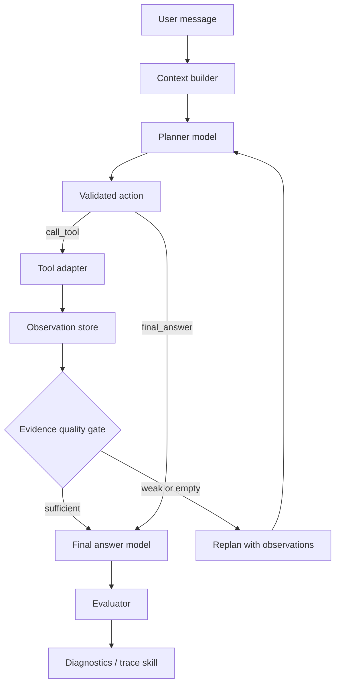

# DataSwarm Agentic Loop V2 Execution Plan

## Objective

Build a multi-step, observable, self-diagnostic agentic runtime that can plan, call tools, inspect observations, retry weak evidence, and only then answer. The runtime must support future swarm execution without trapping the MVP in a one-shot tool pattern.

## Current Status

This document is the historical Phase 1 execution plan for Agentic Loop V2. The current canonical roadmap is [DATASWARM_CANONICAL_PLAN.md](./DATASWARM_CANONICAL_PLAN.md); this file remains useful as the focused rationale for why the loop was rebuilt.

As of 2026-06-11:

- Bounded planner loops, replan on weak observations, generic `web.search` with a provider registry, provider parameter passthrough, `trace.query`, evidence-quality evaluation, and trace diagnostics are implemented and covered by `node scripts/agentic-loop-v2-smoke.mjs`.
- Skills are planner-selected through `use_skill`, create durable `source_type=skill` Observations, and are covered by Skills V2 and skills-observation e2e smoke gates.
- `artifact.create`, `file.read`, and `approval.request` are model-selectable adapters rather than roadmap-only catalog rows.
- `spawn_agent` and `spawn_swarm` now enter the same `AgentAction -> validate -> execute -> Observation -> replan/final` loop through the planner-owned mock sandbox-agent provider.
- Real E2B execution has an SDK path, a pinned template contract, readiness diagnostics, and explicit template-verification gating; live sandbox execution is still pending runtime credentials and template receipt.
- Async self-improvement candidates are generated outside normal chat, are replayable/idempotent, and require shadow testing plus human decision before being marked applied.

## Original Core Problems Observed

- One planner call produces exactly one action, so the runtime cannot recover from empty or weak tool results.
- Tool adapters discard useful model-selected parameters, especially Tavily `max_results`, `search_depth`, domains, and raw-content options.
- Run evaluation checks protocol health, but not evidence quality. A run with `0 source(s)` can still receive a perfect score.
- Conversation diagnostics exists as a repository helper, but it is not exposed as a first-class agent tool.
- Trace data is recorded, but the system is not yet using it as an operational feedback loop for self-improvement.
- Skills are visible in UI, but need to become planner guidance and traceable runtime context rather than static sidebar metadata.

These problems drove Phase 1. The items above are now either implemented or moved into the canonical Real Swarm/E2B phases; do not use this section as a current defect list without checking [IMPLEMENTATION_STATUS.md](./IMPLEMENTATION_STATUS.md).

## Non-Goal: Tavily-Centric Runtime

Agentic Loop V2 must not hard-code an internet-search worldview around Tavily. `web.search` is the default model-facing `web_search` adapter; Tavily is the first provider behind that adapter because it is available today, while `mock.search` is the built-in local proof provider for deterministic validation. The planner should reason over a capability catalog:

- `web_search`: `web.search` today with provider candidates such as Tavily and mock; future GitHub search, browser search, search-provider fallback.
- `trace_query`: DataSwarm local diagnostics over conversations, runs, traces, spans, logs, observations, evals, artifacts.
- `artifact_create`: Markdown, HTML, structured data, visual/report artifacts.
- `file_read` / `file_write`: local workspace inspection and edits.
- `data_query` / `data_profile`: SQLite/Postgres/OLAP sources and uploaded datasets.
- `code_execution` / `sandbox`: E2B or local sandbox tasks.

The runtime loop should stay tool-agnostic: planner proposes an action from the enabled catalog, runtime validates and executes the adapter, observation records evidence, evaluator grades result quality, and weak evidence triggers replan.

## Runtime Architecture



## Skill + Tool Relationship

Skills define task policy, workflow expectations, and domain heuristics. Tools perform concrete operations and create observations. A selected skill is not evidence that work happened.

- `web-research` guides the planner toward source-diverse external evidence and appropriate `web_search` tools.
- `report-generation` guides artifact/report shape, but artifact content still needs observations or artifact adapters.
- `trace-diagnostics` guides debugging and self-improvement tasks toward `trace.query`.
- Runtime records `skill.selected` events and `skill_usages` only after the planner model emits a `use_skill` action; there is no regex preselection in the runtime path.
- Planner receives the available skill catalog, active skills, and available tools separately, preserving the distinction between strategy and execution.

## Phase 1 Implementation Status

- [x] Add bounded agent loop with configurable step budget.
- [x] Re-run planner after weak or empty observations.
- [x] Pass previous observations, source counts, URLs, query text, and failure reasons back to the planner.
- [x] Support Tavily parameters: `max_results`, `search_depth`, `topic`, `include_answer`, `include_raw_content`, `include_domains`, `exclude_domains`.
- [x] Generalize multiple `web_search` providers beyond Tavily.
- [x] Mark `trace.query` as an implemented internal tool.
- [x] Add a `trace.query` adapter that returns conversation diagnostics as a real local observation.
- [x] Add evidence-quality evaluator checks for empty source results and fake-perfect evals.
- [x] Add `trace-diagnostics` as a local skill and make conversation/run/trace diagnosis requests select it.
- [x] Add regression smoke tests that verify code invariants and the known weak run in `conv_b0d87605c4d04288982736d134d5f441`.

## Verification Commands

`DATASWARM_CANONICAL_PLAN.md` is the authoritative verification matrix. This list mirrors the current Phase 1-5 runner so this historical V2 plan does not drift from the combined `/goal` execution path.

Run these before considering the current Runtime V2 / Real-Swarm line healthy:

```bash
node scripts/canonical-verification-runner.mjs --dry-run
npm --prefix apps/web run typecheck
npm --prefix apps/web run lint
node scripts/agentic-loop-v2-smoke.mjs
node scripts/web-search-provider-smoke.mjs
node scripts/web-search-provider-e2e-smoke.mjs
node scripts/tool-event-contract-e2e-smoke.mjs
node scripts/event-protocol-e2e-smoke.mjs
node scripts/skills-v2-smoke.mjs
node scripts/skills-install-api-smoke.mjs
node scripts/skills-observation-e2e-smoke.mjs
node scripts/sandbox-agent-smoke.mjs
node scripts/sandbox-agent-model-smoke.mjs
node scripts/sandbox-retry-policy-smoke.mjs
node scripts/run-cancel-lifecycle-smoke.mjs
node scripts/run-cancel-api-smoke.mjs
node scripts/swarm-action-plan-smoke.mjs
node scripts/sandbox-retry-e2e-smoke.mjs
node scripts/e2b-template-smoke.mjs
node scripts/e2b-template-receipt-smoke.mjs
node scripts/e2b-readiness-smoke.mjs
node scripts/e2b-live-receipt-smoke.mjs
node scripts/run-trace-system-readiness-smoke.mjs
node scripts/e2b-preflight-e2e-smoke.mjs
node scripts/e2b-template-verification-e2e-smoke.mjs
node scripts/swarm-reducer-smoke.mjs
node scripts/swarm-verifier-smoke.mjs
node scripts/swarm-review-smoke.mjs
node scripts/swarm-trace-ui-smoke.mjs
node scripts/approval-lifecycle-smoke.mjs
node scripts/self-improvement-async-smoke.mjs
node scripts/self-improvement-diagnostics-smoke.mjs
node scripts/self-improvement-lifecycle-smoke.mjs
node scripts/self-improvement-ui-smoke.mjs
node scripts/self-improvement-summary-smoke.mjs
node scripts/self-improvement-summary-api-smoke.mjs
node scripts/trace-diagnostics-improvements-smoke.mjs
node scripts/trace-diagnostics-sandbox-smoke.mjs
node scripts/canonical-verification-diagnostics-smoke.mjs
node scripts/canonical-goal-audit-smoke.mjs
node scripts/canonical-goal-audit.mjs
npm --prefix apps/web run build
node scripts/e2b-sandbox-smoke.mjs
node scripts/e2b-orchestrator-e2e-smoke.mjs
```

Use `node scripts/canonical-verification-runner.mjs --phase phase4 --only e2b-readiness,e2b-live-receipt,e2b-live-sandbox,e2b-orchestrator-e2e` for a focused E2B readiness/live E2E gate pass. Use `--require-live-e2b` only for final completion audits, because it intentionally exits non-zero when live external gates are gated by missing credentials or template receipt.

Use `node scripts/canonical-goal-audit.mjs --require-live-e2b` as the final completion audit before marking the combined goal complete. The default audit mode may pass while reporting `completion_status=incomplete_live_e2b_gated`; strict mode must not pass until both the live external E2B sandbox smoke and the Orchestrator E2B E2E receipt gates are present and passed.

The smoke gates must prove:

- bounded multi-step runtime wiring exists;
- `agent.replan.requested` can be emitted for weak/empty observations;
- Tavily options are passed through;
- `trace.query` is implemented and enabled;
- evaluator checks fresh web evidence and empty-result recovery;
- diagnostics detects the historical false-positive health score in `conv_b0d87605c4d04288982736d134d5f441`;
- `trace-diagnostics` exists as a reusable local skill.
- terminal tool events carry `observation_id` and evidence metadata;
- `ARCHITECTURE.md`, `SCHEMA.md`, and `EVENT_PROTOCOL.md` stay aligned with current Runtime V2 contracts;
- E2B readiness failures are explicit, secret-safe, and persisted as branch failure evidence rather than hidden behind mock execution.
- Skills V2 install/update and planner-selected `use_skill` Observations are verified through both static and production API smokes.
- `spawn_swarm` stays planner-owned, branch plans are model-provided when available, and reduce/verify/review stages are separately inspectable.
- Approval, cancellation, retry, sandbox preflight, and Run Trace readiness surfaces have dedicated smoke gates.
- Self-improvement candidates remain asynchronous, review-gated, idempotent, visible from Run Trace, and connected to diagnostics remediation including canonical verification gaps.
- Canonical verification receipts are summarized by conversation diagnostics / `trace.query`, and strict live E2B completion requires both a real external sandbox receipt and an Orchestrator E2B E2E receipt.
- The final `/goal` completion decision is backed by `canonical-goal-audit`, not by manually eyeballing runner output.

## Phase 2 Implementation Status

- [x] Add typed step/tool budgets at runtime level.
- [x] Add evidence grading sufficient for evaluator and diagnostics gates.
- [x] Add query diversification and replan guidance for weak or constrained web research.
- [x] Add artifact generation as an adapter rather than final-answer inline HTML.
- [x] Expand observation contradiction detection into a stronger reusable verifier.
- [x] Generalize multiple `web_search` providers beyond Tavily.

## Phase 3 Implementation Status

- [x] Add planner-selected `spawn_agent` / `spawn_swarm` actions for complex tasks.
- [x] Accept planner-provided branch definitions for `spawn_agent` / `spawn_swarm` and record `plan_source` in swarm events/observations.
- [x] Run branch agents through sandbox providers in mock mode.
- [x] Persist branch observations and merge summaries into parent trace.
- [x] Add deterministic `swarm.verify` after merge to check branch observations, artifact coverage, failed branch isolation, merge evidence, and conflict signals.
- [x] Extract `swarm.verify` into an independent runtime verifier module with plan-source traceability, branch instruction coverage, duplicate-summary detection, and richer contradiction/source-mismatch signal scanning.
- [x] Extract deterministic Swarm reducer into an independent, evented stage.
- [x] Add optional model-assisted reducer/verifier review on top of the deterministic reducer/verifier contracts.
- [x] Use trace/eval/diagnostic records to create async self-improvement candidates.
- [x] Verify live E2B branch execution with runtime credentials and template receipt, including Orchestrator -> planner-owned `spawn_swarm` -> three real E2B branch sessions -> reduce/merge/verify.

## /goal Recommendation

Use the canonical combined goal for current execution:

```text
/goal Implement the DataSwarm V2-to-Real-Swarm canonical plan: keep the single-agent Runtime V2, Skills V2, Tools/Observations, Artifacts, Trace diagnostics, planner-owned mock Swarm, real E2B gating, and async self-improvement loop aligned under the AgentAction/Observation/Event contract; for every slice, update docs/status and run targeted smoke, typecheck, lint, and cleanup verification.
```

Historical bounded goal for Phase 1 only:

```text
/goal Implement DataSwarm Agentic Loop V2: build a multi-step plan-tool-observe-replan-final runtime; support Tavily parameter passthrough and empty-result retry; expose trace.query as a first-class diagnostic tool; upgrade evaluator and diagnostics to detect weak evidence, empty sources, and false-positive health scores; verify with conversation conv_b0d87605c4d04288982736d134d5f441 and regression smoke tests.
```

For a narrower implementation pass:

```text
/goal Implement Agentic Loop V2 Phase 1 only: bounded multi-step planner loop, Tavily query options, empty-result replan, trace.query adapter, and evidence-quality diagnostics.
```
