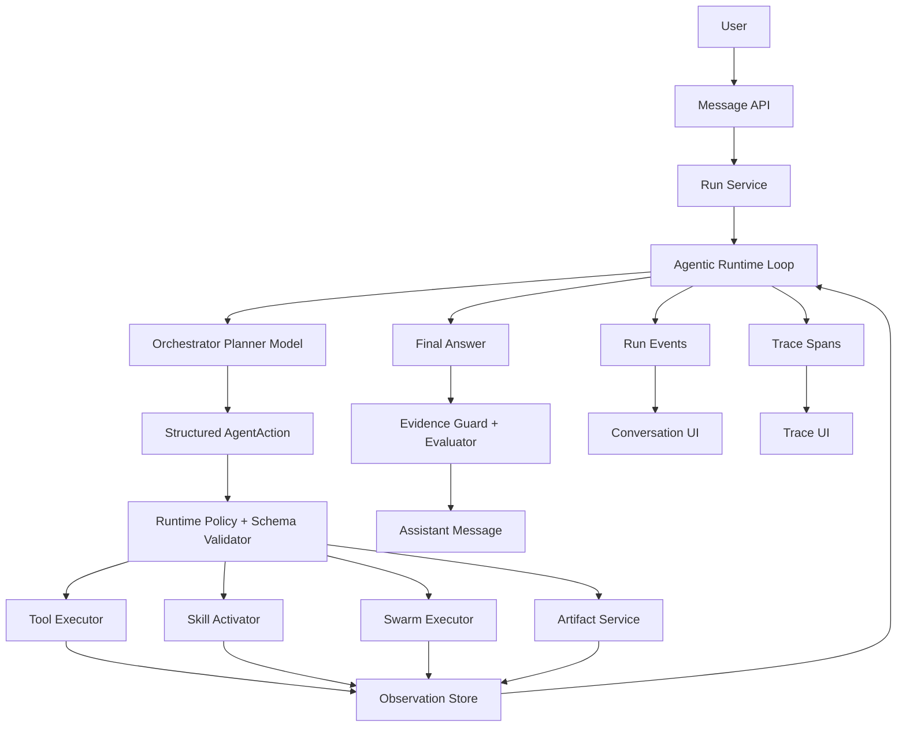

# DataSwarm Agentic Runtime v2 Design

> Version: v0.1  
> Date: 2026-06-11  
> Status: active runtime architecture  
> Scope: keep DataSwarm model-led through generic actions, observations, tools, skills, artifacts, and future swarm execution.

## 0. Implementation Snapshot

As of 2026-06-11, the core V2 loop is implemented:

- The Orchestrator planner model proposes structured `AgentAction`.
- The runtime validates action schema, tool availability, adapter status, and skill availability.
- Executed actions create persisted `Observation` records.
- Tool-backed final answers are expected to cite Observation IDs.
- Implemented adapters include model-facing `web.search`, provider/direct `tavily.search`, `trace.query`, `artifact.create`, `file.read`, and `approval.request`.
- `artifact.create` is now the artifact path for Markdown/HTML deliverables, and artifact persistence uses content-hash de-dupe plus provenance fields for text and sandbox-recovered image artifacts.
- Skills V2 manifests, enable/disable, and local install/update management are implemented for local skill packs.
- Planner-selected skills persist `sourceType=skill` Observations with selection reason, manifest context, alternatives, and replan linkage.
- Planner-owned mock Swarm accepts planner-provided branch definitions on `spawn_agent` / `spawn_swarm`, records `plan_source` (`model_branches`, `model_single_agent`, `model_roles`, or `runtime_fallback`), persists one parent-level `sourceType=agent` branch Observation per branch, and links branch/merge events to those Observation IDs.
- Conversation diagnostics and `trace.query` expose Observation rows plus summary counts for skill/tool/branch/sandbox-preflight evidence, so diagnosis can be driven from persisted evidence instead of UI-only symptoms.
- Terminal tool events (`tool.call.completed` / `tool.call.failed`) carry `action_id`, `tool_call_id`, capability kind, `observation_id`, and `evidence_level`, and the evaluator checks this contract for self-diagnosis.
- Mock-mode deterministic planner triggers are scoped to the latest user message rather than the full planner context, so catalog text or the `DataSwarm` brand name cannot accidentally trigger `use_skill` or `spawn_swarm`.
- Async self-improvement analysis and candidate lifecycle are implemented as internal, review-gated workflows, with Run Trace actions for shadow testing, review bundle preparation, approval/rejection/deferral, and marking verified external application only after an operator-submitted verification receipt covers every required command. In addition to eval checks, diagnostics remediation items can be promoted into de-duplicated review-gated candidates through `run_diagnostics_analysis`.

Still pending:

- Remote skill marketplace install/update flow.
- Live verified E2B-backed `spawn_agent` / `spawn_swarm` execution in the user runtime environment.
- Automatic source patch application from self-improvement candidates.

`web.search` is the default planner-visible `web_search` capability. Tavily remains only the first provider behind that capability and a compatibility/direct adapter; it is not the runtime strategy. The implemented provider registry currently contains `tavily.search` and `mock.search`, and the catalog exposes provider selection as optional input rather than hard-coding one upstream service.

## 1. Why This Redesign Exists

The early DataSwarm MVP could stream messages, persist run events, execute tools such as Tavily, render tool cards, and save Trace. Those foundations were useful, but the first runtime was not truly agentic.

The current behavior is closer to:

```text
User message
-> engineering rules select skills
-> engineering code executes tools
-> tool observations are appended to the prompt
-> model writes a final answer
```

The target behavior is:

```text
User message
-> model decides the next action
-> runtime validates and executes the action
-> observation is persisted and returned to the model
-> model decides whether to call another tool, spawn agents, create artifacts, or answer
-> final answer is checked against observations and Trace evidence
```

The `conv_921b5c51f272492a8f0fc376bf193429` failure exposed the gap:

- First turn did a real web-search tool call because engineering rules matched `搜索互联网`.
- Second turn asked `前几部表现如何`.
- Engineering routing did not select `web-research`.
- No tool call happened.
- The model still claimed it had performed a new web search.
- The evaluator scored the run as healthy because it only checked process completion, not evidence consistency.

This is not just a keyword bug. It is an architecture bug: the model does not currently own tool choice.

## 2. Design Principles

1. Model decides actions; runtime executes actions.
2. Engineering rules may provide hints, never silently replace model decisions.
3. Every model action must be represented as structured data.
4. Every tool, skill, artifact, and swarm branch must produce an Observation.
5. Final answers must cite Observation IDs or explicitly state that no new evidence was gathered.
6. The UI renders run events and observations, not inferred claims from assistant text.
7. Evaluator must judge behavior quality, not only whether a run completed.
8. Temporary guardrails are allowed during migration, but the long-term design is model-led.

## 3. Original Architecture Diagnosis

### 3.1 Current Runtime Flow

Original MVP code path:

```text
POST /api/conversations/:id/messages
-> create task/run/user message
-> runOrchestrator(runId)
-> buildRoutingContext()
-> resolveSkillsForText()
-> if web-research selected, executeTavilySearch()
-> buildModelMessages(observations)
-> model.streamChat()
-> evaluateRunAndRecommend()
-> complete message/run
```

This makes `resolveSkillsForText()` the real decision maker for tool use. The model only sees the result after the fact.

### 3.2 Current Anti-Agentic Properties

| Area | Current behavior | Problem |
|---|---|---|
| Skill choice | Regex/engineering router | Model does not decide skills |
| Tool choice | Tool call is implicit after selected skill | Model cannot request or revise tool use |
| Multi-step execution | One model answer after optional pre-tool step | No iterative plan/act/observe loop |
| Tool claims | Prompt asks model not to invent, but no hard protocol | Model can still claim unsupported tool use |
| Evaluator | Checks run/model/message completion | Does not check whether behavior matched task needs |
| Trace | Records events, but does not encode action intent | Hard to distinguish model decision from engineering pre-processing |

### 3.3 What Should Remain Useful

The existing system has valuable foundations:

- Conversation, task, run, message persistence.
- Run event bus with replayable SSE.
- Trace spans.
- Tool call persistence.
- Existing tool wrappers, including Tavily.
- Skill registry.
- Artifact service.
- Evaluator plumbing.
- UI runtime activity cards.

v2 should reuse these pieces, but change who decides what happens.

## 4. Target Architecture



## 5. Runtime Modes

DataSwarm should explicitly distinguish three modes.

### 5.1 Legacy Mode

The current implementation:

```text
engineering route -> optional tool -> model answer
```

Purpose:

- Keep existing app usable while v2 is built.
- Useful for fallback and regression comparison.

Status:

- Deprecated for primary agentic workflows.

### 5.2 Guarded Legacy Mode

Legacy mode plus:

- Tool-claim consistency checks.
- Fresh-evidence requirement checks.
- Better evaluator failures.

Purpose:

- Short-term safety.
- Prevent obvious unsupported claims.

Status:

- Temporary migration bridge only.

### 5.3 Agentic Loop Mode

Target mode:

```text
model action -> runtime execution -> observation -> model action -> ... -> final answer
```

Purpose:

- True model-led tool calling.
- Multi-step reasoning and tool use.
- Swarm delegation.
- Evidence-bound final answers.

Status:

- New primary runtime.

## 6. Core Protocol: AgentAction

The model must not only emit prose. It must emit a typed action.

```ts
type AgentAction =
  | ThinkAction
  | UseSkillAction
  | CallToolAction
  | SpawnAgentAction
  | CreateArtifactAction
  | AskUserAction
  | FinalAnswerAction;

type ThinkAction = {
  type: "think";
  summary: string;
  next?: string;
};

type UseSkillAction = {
  type: "use_skill";
  skillName: string;
  objective: string;
  reason: string;
};

type CallToolAction = {
  type: "call_tool";
  toolName: string;
  input: Record<string, unknown>;
  reason: string;
  expectedEvidence: string[];
  fallbackToolNames?: string[];
};

type SpawnAgentAction = {
  type: "spawn_agent";
  agentRole: string;
  objective: string;
  contextRefs: string[];
  modelProfile?: string;
  sandboxRequired: boolean;
};

type CreateArtifactAction = {
  type: "create_artifact";
  artifactType: "markdown" | "html" | "json" | "csv" | "image";
  title: string;
  sourceObservationIds: string[];
  instructions: string;
};

type AskUserAction = {
  type: "ask_user";
  question: string;
  reason: string;
  requiredToProceed: boolean;
};

type FinalAnswerAction = {
  type: "final_answer";
  content: string;
  evidenceObservationIds: string[];
  limitations: string[];
  recommendedNextQuestions: string[];
};
```

## 7. Planner Output Envelope

Every planner model call should return:

```ts
type PlannerOutput = {
  action: AgentAction;
  confidence: number;
  assumptions: string[];
  policyNotes: string[];
};
```

Example for the failed `conv_921` second turn. This example uses `tavily.search` only because the current MVP has Tavily available as the default web-search tool. The design must work the same way for any registered tool.

```json
{
  "action": {
    "type": "call_tool",
    "toolName": "tavily.search",
    "fallbackToolNames": ["web.search", "browser.search"],
    "reason": "The user asks about the historical performance of prior seasons, and the previous search only covered 2026 scheduling. Fresh rating, viewership, and reputation evidence is required.",
    "input": {
      "query": "凡人修仙传 动画 前几部 表现 口碑 评分 播放量 B站 豆瓣"
    },
    "expectedEvidence": ["ratings", "viewership", "reputation", "season list"]
  },
  "confidence": 0.91,
  "assumptions": ["前几部 refers to prior animation seasons of 凡人修仙传"],
  "policyNotes": []
}
```

## 8. Observation Model

Observations are the runtime's evidence units. They are more important than raw tool output.

```ts
type Observation = {
  id: string;
  runId: string;
  stepId: string;
  sourceType: "tool" | "skill" | "agent" | "artifact" | "user" | "system";
  sourceName: string;
  status: "completed" | "failed" | "blocked";
  summary: string;
  payloadUri?: string;
  evidenceLevel: "real" | "mock" | "inferred" | "user_provided";
  claims: ObservationClaim[];
  createdAt: string;
};

type ObservationClaim = {
  claim: string;
  support: "direct" | "indirect" | "weak" | "contradicted";
  sourceRefs: Array<{
    title?: string;
    url?: string;
    payloadPath?: string;
  }>;
};
```

Tool output should not go directly into the model as an unstructured blob. It should be normalized into Observations.

## 8.1 Tool Capability Model

The planner should not be optimized around a single tool. It should see a capability catalog and choose the best tool for the current step.

```ts
type ToolCapability = {
  id: string;
  name: string;
  displayName: string;
  description: string;
  provider: string;
  adapterStatus: "implemented" | "planned" | "disabled";
  capabilityKind:
    | "web_search"
    | "web_extract"
    | "file_read"
    | "file_write"
    | "code_execution"
    | "data_query"
    | "data_profile"
    | "visualization"
    | "artifact_create"
    | "trace_query"
    | "approval"
    | "sandbox"
    | "custom";
  inputSchema: Record<string, unknown>;
  outputSchema: Record<string, unknown>;
  riskLevel: "low" | "medium" | "high";
  requiresApproval: boolean;
  authStatus: "available" | "missing_credentials" | "not_configured";
  freshness: "realtime" | "near_realtime" | "static" | "local";
  costHint?: "free" | "low" | "medium" | "high";
  latencyHintMs?: number;
  evidenceKind:
    | "external_source"
    | "local_file"
    | "computed_result"
    | "artifact"
    | "trace"
    | "user_approval"
    | "sandbox_result";
  enabled: boolean;
};
```

Important fields:

| Field | Why it matters |
|---|---|
| `capabilityKind` | The planner reasons about task needs at this level, not around vendor/tool names. |
| `name` | The concrete executable tool adapter name. |
| `adapterStatus` | Prevents the planner from selecting tools that are only conceptual. |
| `authStatus` | Makes missing credentials visible instead of silently falling back to mock behavior. |
| `freshness` | Helps the planner choose between realtime search, static docs, local files, and trace data. |
| `evidenceKind` | Tells the final-answer guard how claims from this tool can be used. |

The planner chooses a tool by capability and context:

| Task need | Preferred capability kind | Example tools |
|---|---|---|
| Search current external facts | `web_search` | `tavily.search`, future `browser.search`, future MCP search providers |
| Read a provided document | `file_read` | local file reader, PDF parser, Markdown reader |
| Analyze a CSV/XLSX | `data_profile`, `code_execution` | data profiler, Python sandbox |
| Run scientific computation | `code_execution`, `sandbox` | E2B/Python runtime |
| Generate a report artifact | `artifact_create` | Markdown/HTML artifact service |
| Inspect prior execution | `trace_query` | Trace query tool |
| Ask for permission | `approval` | approval request tool |

This means Tavily is only one concrete implementation of `web_search`, not a privileged architectural concept.

### 8.2 Capability-First Tool Selection

The planner should reason in two steps:

```text
1. What capability is required now?
2. Which enabled, implemented, policy-allowed tool best satisfies that capability?
```

Examples:

| User need | Capability need | Possible concrete tools |
|---|---|---|
| "搜索互联网，调研 Hermes Agent" | `web_search`, possibly `web_extract` | `tavily.search`, future `browser.search`, future `github.search`, future `searchapi.search` |
| "分析这个 CSV" | `file_read`, `data_profile`, `code_execution` | CSV reader, Python sandbox, data profiler |
| "诊断 conv_xxx 为什么表现差" | `trace_query`, `data_query` | trace query, SQLite/Postgres diagnostic query |
| "生成 HTML 报告" | `artifact_create` | Markdown artifact service, HTML artifact service, sandbox renderer |
| "跑一个因果推断实验" | `code_execution`, `sandbox` | E2B Python sandbox, local Python sandbox |

The model may mention capability in its reasoning, but the emitted action must name a concrete executable tool:

```json
{
  "type": "call_tool",
  "toolName": "trace.query",
  "reason": "The user supplied a conversation ID and asks for behavior diagnosis; persisted run events and spans are the authoritative evidence.",
  "input": {
    "conversationId": "conv_921b5c51f272492a8f0fc376bf193429",
    "include": ["runs", "events", "actions", "observations", "tool_calls", "logs"]
  },
  "expectedEvidence": ["run sequence", "tool calls", "model actions", "final answer grounding"]
}
```

### 8.3 No Tool Is Special

The architecture must pass a "tool neutrality" test:

1. Removing Tavily from the registry must not break the planner protocol.
2. Adding another `web_search` provider must not require changing planner prompts beyond the capability catalog.
3. Adding a non-search tool such as `trace.query`, `file.read`, or `python.execute` must use the same `call_tool -> Observation` flow.
4. UI cards must be rendered from generic action/tool/observation events, not from Tavily-specific event logic.
5. Evaluator checks must ask "was required evidence gathered?" rather than "was Tavily called?"

Tavily can remain the first implemented smoke adapter, but it must be treated as replaceable.

### 8.4 Adapter Contract

Every tool adapter must implement the same runtime contract:

```ts
type ToolAdapter = {
  capability: ToolCapability;
  validateInput(input: Record<string, unknown>): ValidationResult;
  execute(input: ToolExecutionInput): Promise<ToolExecutionResult>;
  normalize(result: ToolExecutionResult): Observation;
};
```

The runtime never embeds vendor-specific logic in the agent loop. It resolves an adapter by `toolName`, validates schema/policy, executes it, and stores the normalized Observation. Vendor-specific code belongs only inside adapters.

### 8.5 Planner Catalog Retrieval

For small catalogs, the planner can receive all enabled tools. For larger catalogs, runtime should retrieve a compact candidate set:

```text
all tools/skills
-> policy filter
-> credential filter
-> adapterStatus filter
-> capability retrieval by task need
-> planner-visible candidate catalog
```

This retrieval step is not a hidden decision. It only limits context size and removes unavailable tools. If multiple tools satisfy the same capability, the planner should see the alternatives and choose one.

## 9. Agentic Loop

```ts
async function runAgenticLoop(runId: string) {
  const state = await loadRunState(runId);

  while (state.stepCount < state.budget.maxSteps) {
    const plannerOutput = await callPlannerModel({
      messages: state.messages,
      observations: state.observations,
      availableSkills: state.availableSkills,
      availableTools: state.availableTools,
      runtimeHints: state.runtimeHints,
      budgets: state.budget,
    });

    await persistAction(plannerOutput.action);

    const validation = validateAction(plannerOutput.action, state);
    if (!validation.allowed) {
      const observation = await recordBlockedAction(plannerOutput.action, validation);
      state.observations.push(observation);
      continue;
    }

    if (plannerOutput.action.type === "call_tool") {
      const observation = await executeToolAction(plannerOutput.action);
      state.observations.push(observation);
      continue;
    }

    if (plannerOutput.action.type === "use_skill") {
      const observation = await activateSkill(plannerOutput.action);
      state.observations.push(observation);
      continue;
    }

    if (plannerOutput.action.type === "spawn_agent") {
      const observation = await spawnAgent(plannerOutput.action);
      state.observations.push(observation);
      continue;
    }

    if (plannerOutput.action.type === "create_artifact") {
      const observation = await createArtifact(plannerOutput.action);
      state.observations.push(observation);
      continue;
    }

    if (plannerOutput.action.type === "final_answer") {
      await validateFinalAnswer(plannerOutput.action, state.observations);
      return completeRun(plannerOutput.action);
    }
  }

  return completeRunWithBudgetLimit(state);
}
```

## 10. Tool Calling Semantics

### 10.1 Model-Owned Decision

The model decides:

- Whether a tool is needed.
- Which tool to call.
- What query/input to use.
- Whether the result is sufficient.
- Whether another tool call is required.

The runtime decides:

- Whether the tool exists.
- Whether the input schema is valid.
- Whether the tool is allowed under policy.
- Whether approval is required.
- Whether the budget permits execution.
- How to execute and persist the result.

The runtime must not silently rewrite a model decision into another tool call. If the selected tool is unavailable but the action includes `fallbackToolNames`, the runtime may either:

1. validate and execute the first fallback that is enabled, implemented, policy-allowed, and capability-compatible; or
2. record a blocked Observation and ask the planner to choose again.

In both cases, the action event must make the substitution or block visible. Silent fallback would recreate the original engineering-routed problem.

### 10.2 Tool Action Lifecycle

```text
action.proposed
action.validated
tool.call.requested
tool.call.started
tool.call.output
observation.created
tool.call.completed
```

The UI should show the tool card because a model action requested it, not because engineering code preselected it.

Minimum event payload contract:

| Event | Required payload |
|---|---|
| `action.proposed` | `action_id`, `action_type`, `tool_name?`, `capability_kind?`, `reason`, `model_profile` |
| `action.validated` | `action_id`, `status`, `policy_result`, `selected_tool_name?` |
| `tool.call.requested` | `action_id`, `tool_call_id`, `tool_name`, `capability_kind`, `input_summary` |
| `tool.call.output` | `action_id`, `tool_call_id`, `output_summary`, `payload_uri?`, `evidence_level` |
| `observation.created` | `observation_id`, `action_id`, `source_type`, `source_name`, `summary`, `claim_count` |
| `tool.call.completed` | `action_id`, `tool_call_id`, `tool_name`, `capability_kind`, `status`, `observation_id`, `evidence_level`, `execution_mode?`, `payload_uri?` |
| `tool.call.failed` | `action_id`, `tool_call_id?`, `tool_name`, `capability_kind`, `status`, `observation_id`, `evidence_level`, `error` |

### 10.3 Tool Selection Strategy

The planner should choose tools by task state, evidence need, and available capability, not by a fixed priority list.

Decision inputs:

- User intent and latest turn.
- Conversation history.
- Available tools and skill affordances.
- Existing observations and gaps.
- Artifact requirements.
- Risk, permission, and budget constraints.

Selection policy:

| User/task condition | Expected planner behavior |
|---|---|
| Needs current/external facts | choose `web_search` or `web_extract` |
| Needs facts from uploaded/local files | choose `file_read` first, then `data_profile` or `code_execution` |
| Needs numerical/statistical analysis | choose `data_query` or `code_execution` |
| Needs scientific simulation/computation | choose `sandbox` or `code_execution` |
| Needs visualization | choose analysis tool first if data is missing, then `visualization`/`artifact_create` |
| Needs report generation | use existing observations, then `artifact_create` |
| Needs debugging a prior run | choose `trace_query` |
| Tool risk is medium/high | choose `approval` before execution if policy requires it |
| Evidence is already sufficient | choose `final_answer`, not another tool |

The planner may choose `use_skill` before `call_tool` when a skill provides domain instructions or a coherent tool bundle. It may directly choose `call_tool` when the right tool is obvious and no extra skill context is needed.

Anti-patterns:

- Always choosing web search for any uncertain task.
- Always choosing Tavily for any external information task when other enabled `web_search` or domain-specific tools are available.
- Calling artifact tools before collecting required evidence.
- Using report-generation skill to compensate for missing analysis.
- Repeating the same tool input after weak results without query refinement.
- Asking the user for confirmation when an available low-risk tool can proceed.

### 10.4 Capability Compatibility

Fallbacks and substitutions must be capability-compatible.

Allowed:

```text
Planner chose tavily.search (web_search)
Runtime fallback uses browser.search (web_search)
```

Not allowed:

```text
Planner chose trace.query (trace_query)
Runtime silently executes tavily.search (web_search)
```

If capability compatibility is ambiguous, block and replan instead of guessing.

## 11. Skill Semantics

Skills become model-visible capability packages.

Skills are not tools and must not become another hidden router. A skill can change the model's instructions and expose tool affordances, but it should not automatically execute tools outside the action loop.

### 11.1 Skill Manifest

Each skill should have `skill.json` in addition to `SKILL.md`.

Generic manifest shape:

```ts
type SkillManifest = {
  name: string;
  version: string;
  description: string;
  capabilityKinds: ToolCapability["capabilityKind"][];
  whenToUse: string[];
  tools: string[];
  outputContract: string[];
  mustNot: string[];
  examples?: Array<{
    userIntent: string;
    suggestedActions: AgentAction[];
  }>;
};
```

Example skill:

```json
{
  "name": "web-research",
  "version": "0.2.0",
  "description": "Search and verify external web information.",
  "capabilityKinds": ["web_search", "web_extract"],
  "whenToUse": [
    "The user asks for latest, current, recent, or external facts",
    "The user asks to verify source dates or credibility",
    "The user asks follow-up questions requiring fresh evidence"
  ],
  "tools": ["tavily.search"],
  "outputContract": [
    "Return source title and URL",
    "Separate direct facts from inference",
    "Mark weak or off-topic results"
  ],
  "mustNot": [
    "Claim a search occurred unless a completed tool observation exists",
    "Invent source titles, URLs, dates, scores, or metrics"
  ]
}
```

Other skill examples should follow the same abstraction:

| Skill | Capability kinds | Example tools |
|---|---|---|
| `data-profiling` | `file_read`, `data_profile`, `code_execution` | CSV/XLSX reader, profiler, Python sandbox |
| `scientific-computing` | `code_execution`, `sandbox`, `artifact_create` | Python sandbox, plot renderer |
| `causal-inference` | `data_query`, `code_execution`, `artifact_create` | SQL/query tool, Python causal library sandbox |
| `visualization` | `code_execution`, `visualization`, `artifact_create` | chart renderer, HTML artifact |
| `report-generation` | `artifact_create`, `file_write`, `trace_query` | Markdown/HTML artifact service, trace query |
| `trace-diagnosis` | `trace_query`, `data_query` | Trace query, SQLite/Postgres diagnostics |

### 11.2 Skill Activation

`use_skill` does not mean engineering immediately executes every tool. It means the skill contributes:

- Instructions.
- Tool affordances.
- Output constraints.
- Example action patterns.
- Evaluation criteria.

The model can then call tools provided by the skill.

### 11.3 Skill vs Tool Boundary

| Concept | Decided by | Runtime behavior |
|---|---|---|
| `use_skill` | Model action | Load instructions, constraints, examples, and tool affordances; create skill Observation. |
| `call_tool` | Model action | Validate and execute one concrete adapter; create tool Observation. |
| Engineering hint | Runtime retrieval | Expose possible skills/tools to model; never execute directly. |

Example:

```text
User: "帮我分析上传的销售表，并生成一个报告"
Planner action 1: use_skill data-profiling
Observation 1: data-profiling instructions and candidate tools loaded
Planner action 2: call_tool file.read
Observation 2: file metadata and parsed rows
Planner action 3: call_tool python.execute
Observation 3: summary stats and charts
Planner action 4: call_tool artifact.create
Observation 4: Markdown/HTML report artifact
Planner action 5: final_answer
```

## 12. Runtime Hints

Engineering logic may still compute hints:

```ts
type RuntimeHint = {
  kind: "suggest_skill" | "suggest_tool" | "risk" | "missing_evidence";
  target: string;
  confidence: number;
  reason: string;
};
```

Example:

```json
{
  "kind": "suggest_skill",
  "target": "web-research",
  "confidence": 0.78,
  "reason": "User asks about performance metrics that likely require external evidence."
}
```

Important: hints are input to the model, not silent control flow.

## 13. Evidence Guard

Evidence Guard remains necessary, but its purpose changes.

It should not be used to compensate for bad routing. It should enforce final-answer integrity.

Rules:

1. If final answer claims a tool was used, it must cite a matching Observation ID.
2. If final answer cites a source URL, that URL must exist in observations.
3. If final answer claims fresh/current/latest facts, the answer must cite fresh observations or disclose no fresh lookup occurred.
4. If the task requires external evidence and no tool was called, the final answer should not provide factual conclusions; it should either call a tool or return an explicit limitation.

## 14. Evaluator v2

Evaluator must score behavior, not just process completion.

### 14.1 Required Checks

| Check | Failure condition | Severity |
|---|---|---|
| `planner_action_exists` | No structured action emitted | High |
| `tool_claim_consistency` | Assistant claims tool use without observation | Critical |
| `required_evidence_coverage` | Task required external evidence but no real observation exists | High |
| `source_grounding` | Answer cites source not present in observations | Critical |
| `action_policy_validity` | Tool action violated schema/policy | High |
| `tool_neutrality` | Runtime used a vendor/tool-specific shortcut outside `AgentAction` | High |
| `capability_fit` | Selected tool capability does not match the task need | Medium |
| `loop_progress` | Repeated same action/input without new information | Medium |
| `final_answer_evidence_refs` | Final answer has no evidence refs for factual claims | High |
| `artifact_grounding` | Artifact created without source observations or message refs | Medium |

### 14.2 Expected Result for `conv_921`

Old evaluator:

```text
100%, because run/model/message completed.
```

v2 evaluator:

```text
Fail:
- required_evidence_coverage failed
- tool_claim_consistency failed
- source_grounding unknown or failed
```

## 15. Trace v2

Trace should distinguish decisions from executions.

New span kinds:

- `agent.plan`
- `action.validate`
- `action.blocked`
- `skill.activate`
- `tool.call`
- `observation.create`
- `agent.reflect`
- `agent.finalize`
- `evaluator.check`

New events:

- `action.proposed`
- `action.validated`
- `action.blocked`
- `observation.created`
- `observation.failed`
- `final_answer.started`
- `final_answer.completed`
- `evaluator.check.completed`

## 16. UI Implications

The conversation UI should display:

1. Model proposed action card.
2. Tool execution card.
3. Observation summary card.
4. Final answer card.

Example:

```text
Assistant Action: call_tool <toolName>
Capability: <capabilityKind>
Reason: <why this tool is needed now>

Tool call: <toolName>
Status: completed
Output: <short structured summary>

Observation: obs_123
Summary: <normalized evidence summary>

Assistant Final Answer
Evidence: obs_123, obs_124
```

This makes it obvious whether tool use was model requested or engineering injected.

Concrete web-search example. This example uses Tavily only as one replaceable `web_search` adapter:

```text
Assistant Action: call_tool tavily.search
Capability: web_search
Reason: Need external evidence about prior season ratings and viewership.

Tool call: tavily.search
Status: completed
Output: 5 external sources

Observation: obs_web_123
Summary: Returned Bilibili, Douban, and media sources...
```

Concrete trace-diagnosis example:

```text
Assistant Action: call_tool trace.query
Capability: trace_query
Reason: User supplied a conversation ID and asked why the behavior was poor.

Tool call: trace.query
Status: completed
Output: 3 runs, 42 events, 1 missing action record, 0 observations

Observation: obs_trace_456
Summary: Second turn skipped the planner/tool loop and final answer made unsupported search claims.
```

## 17. Data Model Additions

MVP can add minimal new tables:

### 17.1 `agent_actions`

| Column | Notes |
|---|---|
| `id` | `act_...` |
| `run_id` | run |
| `step_id` | optional |
| `agent_session_id` | proposer |
| `action_type` | `call_tool`, `final_answer`, etc. |
| `status` | `proposed`, `validated`, `executed`, `blocked`, `failed` |
| `action_json` | structured action |
| `model_profile` | model that proposed action |
| `created_at` | timestamp |

### 17.2 `observations`

| Column | Notes |
|---|---|
| `id` | `obs_...` |
| `run_id` | run |
| `action_id` | source action |
| `source_type` | `tool`, `skill`, `agent`, `artifact`, `user`, `system` |
| `source_name` | e.g. `tavily.search` |
| `status` | `completed`, `failed`, `blocked` |
| `summary` | short text |
| `payload_uri` | full payload |
| `evidence_level` | `real`, `mock`, `inferred`, `user_provided` |
| `claims_json` | normalized claims |
| `created_at` | timestamp |

### 17.3 Existing Tables to Reuse

- `run_events`
- `trace_spans`
- `tool_calls`
- `skill_usages`
- `artifacts`
- `eval_results`

## 18. Model Provider Requirements

The provider layer needs structured output support.

MVP implementation options:

1. OpenAI-compatible JSON mode if provider supports it.
2. Prompted JSON with schema validation and repair retry.
3. Two-model-call pattern:
   - Planner call returns action JSON.
   - Final answer call returns user-facing prose.

For reliability, use schema validation plus repair retry even if JSON mode exists.

## 19. Planner Prompt Contract

Planner system prompt should say:

```text
You are DataSwarm Orchestrator Planner.
You do not answer the user directly unless you choose final_answer.
Choose exactly one action.
Use tools when fresh, external, current, or source-backed evidence is required.
Never claim a tool result. Tool results arrive only as Observations.
If observations are insufficient, call a tool or ask a required clarification.
Return only JSON matching the AgentAction schema.
```

## 20. Final Answer Prompt Contract

Final answer model call should say:

```text
Answer using only:
- conversation messages
- observations
- artifacts explicitly referenced

Every factual claim from a tool must be backed by observation IDs.
If no observation exists for a claim, mark it as an inference or omit it.
Do not claim you searched unless an observation from a search tool exists.
```

## 21. Migration Plan

### Phase A0: Tool-Neutral Design Lock

Deliverables:

- Freeze the agent loop around `AgentAction -> validate -> adapter -> Observation`.
- Define generic `ToolAdapter` contract.
- Add `adapterStatus`, `authStatus`, `freshness`, and `capabilityKind` to tool catalog.
- Remove Tavily-specific assumptions from planner prompt, UI event mapping, and evaluator language.
- Treat `web.search` as the model-facing `web_search` adapter and Tavily as one replaceable provider implementation.

Acceptance:

- Design review can replace the provider behind `web.search`, or add `browser.search`, without changing the architecture.
- At least three different capability kinds are represented in the catalog, even if only one is implemented.
- Runtime tests assert event contracts by `action_id` and `observation_id`, not by Tavily-specific payloads.

### Phase A: Prepare Protocol and Storage

Deliverables:

- Define `AgentAction` TypeScript types.
- Define `Observation` TypeScript types.
- Add `agent_actions` and `observations` schema.
- Add event types: `action.proposed`, `action.validated`, `action.blocked`, `observation.created`.
- Keep legacy runtime unchanged except for optional guardrails.

Acceptance:

- A no-tool task produces `action.proposed(final_answer)` and a final answer.
- Trace shows model action before message completion.

### Phase B: Planner-First Generic Single-Tool Loop

Deliverables:

- Add planner model call before final answer.
- Load enabled `ToolCapability` records into planner context.
- Let planner choose one `call_tool` action from available implemented tools.
- Runtime executes the selected tool only when planner emits `call_tool`.
- Create Observation from the selected tool result.
- Call planner/final model again after observation.
- Publish generic action/tool/observation events with `action_id` and `observation_id`.

Acceptance:

- For `前几部表现如何`, first action is model-proposed `call_tool` using a `web_search` tool, currently `tavily.search`.
- For a local file analysis request, first action can be model-proposed `call_tool` using a `file_read` or `data_profile` tool when those tools are enabled.
- `tool.call.*` events reference the action ID regardless of tool type.
- UI can show "Assistant requested <toolName>".
- If a tool is unavailable or unimplemented, runtime records a blocked Observation and replans instead of pretending the tool ran.

### Phase B2: Multi-Adapter Proof

Deliverables:

- Implement at least two non-Tavily adapters:
  - `trace.query` for run/conversation diagnostics.
  - `artifact.create` for Markdown/HTML artifact generation from observations.
- Optionally add `file.read` as the first local-file adapter.
- Add adapter registry lookup by `toolName`.
- Add generic adapter test harness.

Acceptance:

- A conversation diagnostic task chooses `trace.query`, not `tavily.search`.
- A report task with sufficient observations chooses `artifact.create`, not another web search.
- A file-analysis task chooses `file.read` or blocks with a clear missing-adapter Observation.
- UI renders all these tool cards through the same generic component path.

### Phase C: Skill Manifests and Tool Affordances

Deliverables:

- Add `skill.json` to installed skills.
- Load skill manifests into planner context.
- `use_skill` action activates skill instructions/tools.
- Skill selection is model-visible and traceable.
- Skills expose a set of tool affordances, but do not force immediate tool execution.

Acceptance:

- Skills such as `web-research`, `data-profiling`, and `report-generation` are selected by model action, not by regex.
- Trace shows `action.proposed(use_skill)` then tool affordances.

### Phase D: Multi-Step Loop

Deliverables:

- Support max steps, budget, repeated tool calls, reflection.
- Add loop progress evaluator.
- Add duplicate action detection.

Acceptance:

- A research task can search, inspect weak results, search again with a refined query, then answer.
- A task can mix capabilities, such as `web_search -> artifact_create -> final_answer`, without hard-coded orchestration.

### Phase E: Swarm Actions

Deliverables:

- `spawn_agent` action.
- Sandbox agent action protocol with branch-local `action_proposed`, `action_completed`, and `observation_created` events.
- Dedicated E2B template contract (`dataswarm-agent-runtime`) with a ready-checkable entrypoint.
- Secret-safe E2B readiness contract in the system snapshot, including status, missing environment names, operator next steps, verification commands, template verification receipt state, and live smoke receipt state.
- Conversation diagnostics / `trace.query` surface E2B live smoke receipt coverage and structured remediation items from sandbox sessions, failed branch observations, and branch failure events, so operators can diagnose whether a conversation used verified live sandbox evidence or stopped at preflight.
- Explicit E2B template verification receipt gating (`DATASWARM_E2B_TEMPLATE_VERIFIED=1`, `DATASWARM_E2B_TEMPLATE_BUILD_ID`, or a matching local `data/e2b/template-verification.json` / `DATASWARM_E2B_TEMPLATE_VERIFICATION_RECEIPT`) before `readyForOrchestrator` can become true.
- Controlled local receipt generation through `scripts/e2b-template-receipt.mjs`, verified by `scripts/e2b-template-receipt-smoke.mjs`, so receipt evidence records the checked template/agent file hashes and does not rely on hand-written JSON by default.
- Successful live E2B smoke runs through `scripts/e2b-sandbox-smoke.mjs` write a secret-safe live smoke receipt by default; `scripts/e2b-live-receipt-smoke.mjs` verifies the receipt contract and missing-key skip path without creating an external sandbox.
- Secret-safe E2B branch preflight failures persisted as structured `sandbox_preflight_failed` sandbox metadata, failed branch Observations, and `swarm.branch.failed` event payloads when live execution is gated.
- Run Trace Swarm Tree / Branch Timeline derived from persisted `run_events`.
- Parent orchestrator reduces child observations.

Acceptance:

- Complex task can spawn branch agents with separate observations and final reducer answer.

## 22. Test Strategy

### 22.1 Golden Scenarios

1. Simple answer, no tool needed.
2. Explicit search request uses a `web_search` tool.
3. Follow-up requiring fresh evidence chooses an appropriate tool from the available catalog.
4. Follow-up not requiring tool returns `final_answer`.
5. Search returns weak/off-topic sources and model refines query or discloses weakness.
6. Local file analysis chooses file/data tools, not web search.
7. Report artifact generation uses observations from prior tools.
8. Model tries unsupported tool claim.
9. Multi-step search refinement.
10. Trace diagnosis chooses `trace_query`, not web search.
11. Artifact generation chooses `artifact_create`, not a web tool.
12. Credential-missing tool is blocked with Observation, not mocked silently unless mock mode is explicitly enabled.
13. Multiple tools with the same capability are visible to the planner and the selected one is recorded in `action.proposed`.

### 22.2 `conv_921` Regression

Input:

```text
Turn 1: 搜索互联网，查询“凡人修仙传”相关的信息
Turn 2: 前几部表现如何
```

Expected in v2:

```text
Turn 2:
- action.proposed: call_tool with capabilityKind=web_search
- current MVP concrete tool may be tavily.search, but the assertion is capability-based
- reason mentions prior search only covered schedule/current info
- tool.call.completed exists
- observation.created exists
- final_answer cites observation IDs
- evaluator score does not pass if no observation exists
```

### 22.3 Tool Neutrality Regression

Run the same planner test with different tool catalogs:

```text
Catalog A: tavily.search only
Catalog B: browser.search only
Catalog C: tavily.search + browser.search + trace.query + artifact.create
```

Expected:

- External research tasks choose an enabled `web_search` tool in A/B/C.
- Trace diagnosis tasks choose `trace.query` only when it exists; otherwise they produce a blocked/ask-user/final limitation action.
- Report tasks choose `artifact.create` only when source observations exist or the user explicitly asks for a draft based on current context.
- No test asserts "Tavily must be called" unless the user explicitly names Tavily.

### 22.4 Evidence Integrity Tests

If final answer includes:

```text
我检索到
Tavily 返回
本轮搜索结果
来源显示
```

Then test must assert:

```text
matching observation.sourceType = tool
matching observation.sourceName is the claimed tool if named
observation.status = completed
observation.evidenceLevel in ["real", "mock"]
```

## 23. Implementation Boundaries

What v2 should not do initially:

- Full autonomous long-running background agents.
- Arbitrary shell execution outside sandbox.
- Complex planning trees before basic action loop works.
- Full MCP dynamic discovery UI before core action protocol.
- Replacing all existing UI at once.

What v2 must do first:

- One model action at a time.
- One generic tool execution path.
- One observation store.
- One final-answer evidence validator.
- One UI display path for model-proposed tool action.

## 24. How This Changes the Current Codebase

### Replace

- `resolveSkillsForText()` as the primary decider.
- Direct pre-model tool execution based on engineering skill selection.
- Evaluator that only checks process completion.

### Keep

- Existing concrete tool wrappers such as `executeTavilySearch()`, behind generic tool adapters.
- `tool_calls`.
- `run_events`.
- `trace_spans`.
- SSE.
- Artifact service.
- Existing conversation UI, with added action/observation cards.

### Add

- `planner.ts`
- `actions.ts`
- `observations.ts`
- `agent_actions` repository.
- `observations` repository.
- `AgenticRuntimeLoop`.
- Action schema validator.
- Final answer evidence validator.

## 25. Product-Level Acceptance Criteria

DataSwarm can be considered agentic only when all are true:

1. Tool calls are triggered by persisted model actions, not hidden engineering routing.
2. Every tool card can be traced back to an `action.proposed` event.
3. Every final answer with external factual claims references observations.
4. The evaluator fails unsupported tool claims.
5. The UI can show the difference between:
   - model proposed a tool,
   - runtime executed a tool,
   - model used the observation,
   - final answer cited the observation.
6. A follow-up task can cause the model to call a new tool without adding more regex routing.

## 26. Short-Term Recommendation

Do not continue expanding keyword routing as the main solution.

Use the current guardrail patches only as temporary safety:

- prevent unsupported tool claims,
- improve evaluator detection,
- keep the product from misleading users during migration.

The next real implementation milestone should be Phase A and Phase B:

```text
AgentAction schema
agent_actions table
observations table
planner model call
generic single-tool call loop
final answer with observation refs
```

That is the smallest slice that changes the system from engineering-routed to model-led.
