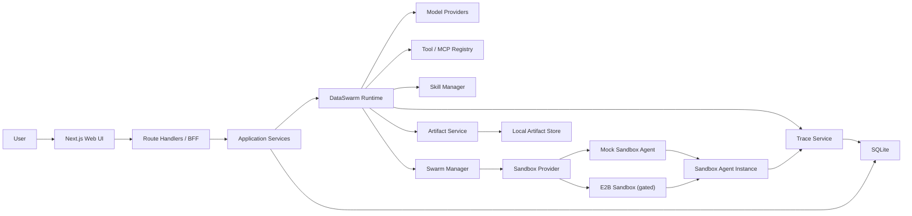
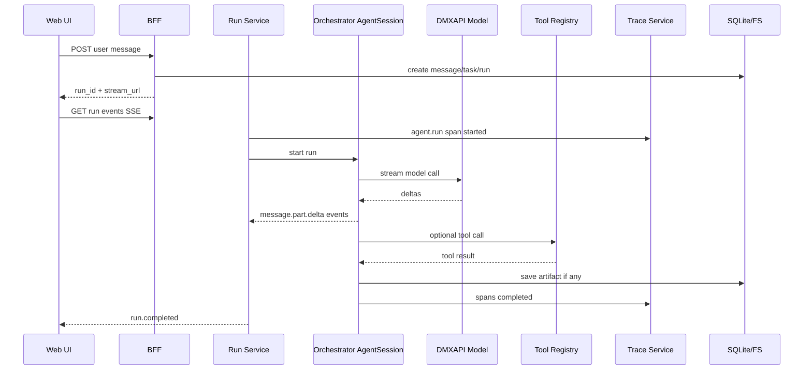
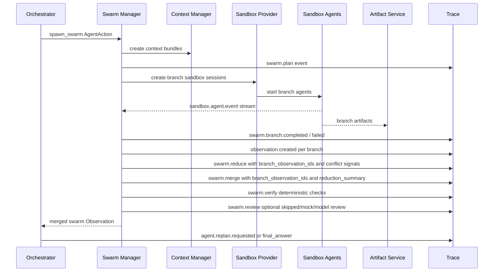

# DataSwarm Architecture

> Version: v0.1  
> Date: 2026-06-11  
> Status: canonical architecture, with Agentic Runtime V2 as current mainline  
> Related docs:
> - [DATASWARM_CANONICAL_PLAN.md](./DATASWARM_CANONICAL_PLAN.md)
> - [DataSwarm多Agent蜂群体系调研与设计.md](./DataSwarm多Agent蜂群体系调研与设计.md)
> - [DataSwarm技术设计执行路径与验证方案.md](./DataSwarm技术设计执行路径与验证方案.md)
> - [SCHEMA.md](./SCHEMA.md)
> - [EVENT_PROTOCOL.md](./EVENT_PROTOCOL.md)
> - [MVP_TASKS.md](./MVP_TASKS.md)

## 0. Current Mainline

The current implementation path is Agentic Runtime V2:

```text
User message
-> Orchestrator planner model
-> structured AgentAction
-> runtime validation
-> adapter execution
-> persisted Observation
-> replan or final answer
```

Current real adapters are model-facing `web.search`, provider/direct `tavily.search`, `trace.query`, `artifact.create`, `file.read`, and `approval.request`. `web.search` now routes through a provider registry: Tavily is the default real provider and `mock.search` is the built-in deterministic validation provider, while Observations keep logical and provider tool names separate. `spawn_agent` and `spawn_swarm` now enter the Orchestrator loop as planner-selected `AgentAction` values and execute the planner-owned mock swarm provider through the same Observation/Event protocol. When the planner supplies explicit branch definitions, the swarm executor records `plan_source=model_branches`; role/count expansion and runtime fallback are explicit compatibility paths rather than hidden routing. Swarm parent runs now include an independent `swarm.reduce` stage before `swarm.merge` and `swarm.verify`.

Real E2B execution has an SDK path, a pinned `dataswarm-agent-runtime` template contract, readiness diagnostics, explicit template-verification gating, and a passed live sandbox smoke receipt. Live E2B branches remain gated in any runtime until it has `E2B_API_KEY` plus `DATASWARM_E2B_TEMPLATE_VERIFIED=1`, `DATASWARM_E2B_TEMPLATE_BUILD_ID`, or a matching local template verification receipt.

Older MVP sections in this document describe the intended full system shape. They should not be read as proof that production real swarm execution is enabled by default; E2B remains explicitly configured and receipt-gated.

## 1. Purpose

DataSwarm is a local-first multi-agent swarm platform for data production, analysis, insight generation, scientific computing, causal inference, visualization, and report generation.

The product entry is a Manus-like Web UI. The user enters a goal, uploads data or references, and receives a streamed agentic execution trace with messages, tool calls, sub-agent progress, and artifacts. A primary Orchestrator asks the planner model to choose models, skills, tools, artifacts, and execution mode. Engineering code exposes capabilities, validates actions, executes adapters, and records evidence; it must not route tools or skills from hard-coded task keywords.

For complex tasks, the target architecture starts a Swarm: multiple sandboxed agent instances, each with a task contract, minimal context bundle, tool policy, model profile, trace exporter, and durable branch Observation. Current implementation uses the same action/observation/event contract with a mock sandbox-agent provider; the real E2B provider is explicit and gated rather than silently substituting mock execution.

The architecture optimizes for:

- Observability from day one.
- Local-first data storage for MVP.
- Clear runtime boundaries.
- Structured event streaming rather than terminal scraping.
- Skill and tool extensibility.
- Sandboxed parallel execution.
- Future migration to Postgres and OSS/S3 without redesigning core object models.

## 2. Confirmed Decisions

| Area | Decision |
|---|---|
| Web stack | Next.js App Router + TypeScript + Tailwind CSS |
| Real-time channel | SSE for MVP, WebSocket later if needed |
| MVP database | SQLite |
| MVP artifact store | Local filesystem |
| Future database | Postgres |
| Future artifact store | Alibaba Cloud OSS or AWS S3 |
| Future analytics store | Optional OLAP, likely ClickHouse if event volume requires it |
| Main model provider | DMXAPI, OpenAI-compatible first, Responses API compatible path retained |
| Orchestrator models | `gpt-5.5-1m`, `claude-opus-4-8` |
| Sandbox models | `deepseek-v4-pro`, `deepseek-v4-flash` |
| Runtime strategy | Self-built DataSwarm Runtime, inspired by OpenCode, Pi/OpenClaw, Hermes, CodeWhale |
| Sandbox provider | E2B |
| Default web research tool | Tavily MCP |
| Report artifacts | Markdown and HTML first |
| Multi-tenancy | Reserve fields now, full auth/tenant isolation later |

## 3. System Context



## 4. Architectural Layers

### 4.1 Presentation Layer

Location: `apps/web`

Responsibilities:

- Conversation list, project/group navigation, skill panel, artifact list.
- Conversation stream rendering.
- Composer with model selection, mode selection, attachments, context progress.
- Tool call cards, plan cards, swarm tree, approval cards.
- Artifact side panel for Markdown, HTML, images, CSV/JSON, logs, trace previews.
- SSE consumption and replay.

Non-responsibilities:

- Direct model calls.
- Direct sandbox control.
- Direct filesystem access outside sanctioned API routes.
- Secret handling.

### 4.2 BFF / API Layer

Location: `apps/web/src/app/api`

Responsibilities:

- HTTP API for conversations, messages, runs, artifacts, skills, trace.
- SSE endpoint for run events.
- File upload endpoint.
- Authentication placeholder and user/project attribution.
- Input validation and request normalization.
- Calling application services.

Implementation notes:

- Use Route Handlers for streaming and uploads.
- Keep SDK clients lazily initialized.
- Persist `run_events` before sending over SSE so client replay is reliable.
- Never return raw secrets or unredacted payloads.

### 4.3 Application Services

Location: `packages/*` or `apps/web/src/server/*` during early MVP.

Services:

- Conversation Service
- Message Service
- Task Service
- Run Service
- Artifact Service
- Skill Service
- Trace Service
- Settings/Model Profile Service

Responsibilities:

- Own business invariants.
- Persist database records.
- Coordinate runtime execution.
- Translate runtime events into persisted `run_events`.
- Enforce user/project attribution.

### 4.4 DataSwarm Runtime

Location: `apps/web/src/server/runtime` now; `packages/runtime` remains the intended extraction boundary once the contracts stabilize.

Responsibilities:

- Create and manage `AgentSession`.
- Execute run loops.
- Select model provider.
- Load minimal context.
- Expose skill and tool catalogs to the planner model.
- Validate planner-selected `AgentAction` values.
- Execute adapters and persist `Observation` records.
- Emit typed runtime events.
- Write trace spans.
- Request approval.
- Delegate complex work to Swarm Manager.

Runtime primitives:

- `AgentSession`
- `RunLoop`
- `RuntimeEventBus`
- `ModelProvider`
- `ToolRegistry`
- `ContextManager`
- `SkillResolver`
- `HookManager`
- `BudgetManager`

### 4.5 Model Provider Layer

Location: `packages/models`

Responsibilities:

- Provide a uniform interface over DMXAPI and DeepSeek.
- Support streaming.
- Support structured output.
- Normalize token usage and cost metadata.
- Normalize errors.
- Apply retry/backoff policy.
- Emit `model.call.*` events and trace spans.

Provider profiles:

| Profile ID | Provider | Model | Role | Protocol |
|---|---|---|---|---|
| `dmx:gpt-5.5-1m` | DMXAPI | `gpt-5.5-1m` | Orchestrator | OpenAI-compatible |
| `dmx:claude-opus-4-8` | DMXAPI | `claude-opus-4-8` | Orchestrator | OpenAI-compatible |
| `deepseek:deepseek-v4-pro` | DeepSeek | `deepseek-v4-pro` | Sandbox execution | OpenAI-compatible |
| `deepseek:deepseek-v4-flash` | DeepSeek | `deepseek-v4-flash` | Sandbox routing/light work | OpenAI-compatible |

### 4.6 Tool / MCP Layer

Location: `packages/tools`

Responsibilities:

- Register built-in tools and MCP tools.
- Validate input/output schemas.
- Enforce tool permissions and approvals.
- Execute tools with timeout and retry policies.
- Redact tool input/output for trace.
- Persist `tool_calls`.

Default tools:

- File read/write for sanctioned workspace paths.
- Artifact create/update.
- CSV/JSON/Markdown/HTML readers.
- Shell/code execution only inside sandbox by default.
- Tavily MCP search/extract.
- Approval request.
- Trace query.
- Cost/budget check.

### 4.7 Skill Layer

Location: `apps/web/src/server/repositories/skills.ts` and top-level `skills/` now; `packages/skills` remains the later extraction boundary.

Responsibilities:

- Discover installed skills.
- Parse `SKILL.md` and optional `skill.json`.
- Expose enabled skill metadata, strategy, quality checks, and available tool combinations to Orchestrator.
- Let the planner model select `use_skill`; do not preselect skills from regex routing.
- Persist skill selections as Observations with selection reason, alternatives, and contribution contract.
- Support prompt-only, script-backed, tool-backed, agent-backed, or swarm-backed skill flows over time.
- Create skill drafts from successful runs.

Skill bundle shape:

```text
skills/<skill-name>/
  SKILL.md
  skill.json
  scripts/
  templates/
  examples/
  references/
```

### 4.8 Swarm Layer

Location: `apps/web/src/server/runtime/swarm.ts` now; `packages/swarm` remains the later extraction boundary.

Responsibilities:

- Execute planner-selected `spawn_agent` and `spawn_swarm` actions.
- Split objective into branch task contracts.
- Build context bundles for branches.
- Create sandbox sessions through the selected Sandbox Provider.
- Start sandbox agent instances.
- Aggregate branch events into parent run events.
- Persist one durable branch Observation per branch.
- Merge branch Observations into a swarm Observation.
- Handle cancellation and failure fan-out.
- Produce final merged result and artifacts.

Current swarm strategy:

- Planner-owned mock sandbox-agent execution using the same protocol as the E2B path.

Near-term strategies:

- Map-Reduce.
- Builder-Reviewer-Fixer.

Later strategies:

- Explore-Exploit.
- Debate + Judge.
- Race-and-Rank.

### 4.9 Sandbox Agent Layer

Location: `sandbox/agent`

Responsibilities:

- Run inside mock sandbox now and inside E2B sandbox when readiness gates pass.
- Receive task contract and context bundle.
- Use DeepSeek model profile.
- Execute allowed sandbox tools.
- Generate Markdown/HTML reports and other artifacts.
- Stream structured events back to parent run.
- Export trace spans.
- Respect budget, deadline, and forbidden actions.

Sandbox agent must be intentionally smaller than main runtime. It should not own project-wide memory, full conversation history, or global settings.

### 4.10 Trace Layer

Location: `packages/trace`

Responsibilities:

- Create trace/span records for every run, model call, tool call, skill usage, context bundle, sandbox, artifact, approval, evaluation.
- Redact sensitive values.
- Store large payloads in local trace payload files.
- Persist span summaries in SQLite.
- Support run trace retrieval.
- Feed evaluation and self-improvement workflows.

Trace is not optional. Any action that cannot be traced should be treated as an implementation defect unless explicitly marked as transient debug-only behavior.

### 4.11 Storage Layer

Location: `packages/storage`

Responsibilities:

- SQLite connection and migrations.
- Local artifact store.
- Local upload store.
- Local trace payload store.
- Content hashing.
- Atomic writes.
- Future adapter interface for Postgres and OSS/S3.

MVP storage paths:

```text
data/
  dataswarm.sqlite
  uploads/
  artifacts/
  traces/
  sandbox-bundles/
```

## 5. Runtime Flow

### 5.1 Single Agent Flow



### 5.2 Swarm Flow



## 6. State Machines

### 6.1 Run Status

Allowed statuses:

- `queued`
- `running`
- `waiting_approval`
- `cancelling`
- `cancelled`
- `completed`
- `failed`

Valid transitions:

```text
queued -> running
running -> waiting_approval
waiting_approval -> running
running -> cancelling
cancelling -> cancelled
running -> completed
running -> failed
waiting_approval -> cancelling
waiting_approval -> failed
failed -> queued       # retry creates a new attempt or replay run
```

Rules:

- `completed`, `failed`, and `cancelled` are terminal for that run record.
- Retry should create a new run or explicit attempt record; it should not mutate history.
- Cancellation must fan out to sandbox sessions.

### 6.2 Agent Session Status

Allowed statuses:

- `created`
- `context_loaded`
- `running`
- `waiting_approval`
- `tool_calling`
- `completed`
- `failed`
- `cancelled`

### 6.3 Sandbox Status

Allowed statuses:

- `requested`
- `creating`
- `running`
- `closing`
- `closed`
- `failed`
- `expired`

Rules:

- Sandboxes must have TTL.
- Sandboxes must heartbeat while running.
- Parent run cancellation must close child sandboxes.

### 6.4 Artifact Status

Allowed statuses:

- `creating`
- `ready`
- `preview_ready`
- `failed`
- `archived`

## 7. Failure Handling

### 7.1 Model Failures

Examples:

- Timeout.
- Rate limit.
- Invalid response.
- Context length exceeded.
- Provider unavailable.

Handling:

- Retry according to provider policy.
- If Orchestrator model fails, optionally switch from `gpt-5.5-1m` to `claude-opus-4-8` or vice versa if policy allows.
- Emit `model.call.failed`.
- Persist normalized error in trace.
- Summarize user-visible failure without exposing secrets.

### 7.2 Tool Failures

Handling:

- Validate before execution.
- Timeout long-running tools.
- Retry idempotent tools only.
- Emit `tool.call.failed`.
- Give Orchestrator the failure as structured observation.
- Continue, degrade, or ask user depending on task criticality.

### 7.3 Sandbox Failures

Handling:

- Retry sandbox creation once by default.
- Keep branch failure isolated.
- Preserve sandbox logs if available.
- Reducer must see failed branch summaries.
- Close orphaned sandboxes via cleanup job.

### 7.4 Artifact Failures

Handling:

- Use atomic file writes.
- Store content hash.
- Never overwrite previous artifact versions.
- If preview generation fails, keep raw artifact downloadable and show preview error.

### 7.5 Trace Failures

Handling:

- Trace persistence failures should not silently disappear.
- If SQLite write fails, write an emergency local JSONL event log.
- Mark run with observability degradation warning.
- Do not block user-facing completion for non-critical trace export failures, but record the problem.

## 8. Security and Privacy Boundaries

### 8.1 Secret Handling

Secrets live only in environment variables or future secret manager.

Required env vars:

- `DMX_API_KEY`
- `DMX_BASE_URL`
- `DEEPSEEK_API_KEY`
- `DEEPSEEK_BASE_URL`
- `E2B_API_KEY`
- `TAVILY_API_KEY`

Rules:

- Never put secrets in prompts.
- Never write full secrets to SQLite.
- Never include full secrets in trace payload.
- Redact secrets from tool inputs, tool outputs, model inputs, model outputs, sandbox logs.

### 8.2 Sandbox Boundaries

- Sandbox receives minimal context bundle.
- Sandbox gets only required environment variables.
- Sandbox cannot access full local project store.
- Sandbox artifact upload path is controlled.
- Sandbox network access is policy-driven.

### 8.3 Approval Boundaries

Require explicit approval for:

- External side effects.
- High-cost calls.
- Destructive file operations.
- Publishing, sending, committing, deploying.
- Accessing private third-party systems.
- Exporting sensitive data.

## 9. Observability Requirements

Every run must provide:

- User message.
- Task objective.
- Model profile used.
- Skill selected.
- Tools invoked.
- Sandbox sessions spawned.
- Artifacts generated.
- Errors and retries.
- Cost estimate.
- Latency.
- Evaluation result.

Minimum trace spans for M1:

- `agent.run`
- `model.call`

Minimum trace spans for M2:

- `agent.run`
- `model.call`
- `tool.call`
- `skill.resolve`
- `artifact.create`

Minimum trace spans for M3:

- all M2 spans
- `context.bundle.create`
- `sandbox.create`
- `sandbox.agent.run`

Minimum trace spans for M4:

- all M3 spans
- `swarm.plan`
- `swarm.branch`
- `swarm.reduce`
- `swarm.merge`
- `swarm.verify`
- `swarm.review`
- `sandbox.agent.run`

Optional model-assisted review is represented by `swarm.review`. It is disabled by default and can run in `mock` or `model` mode without replacing deterministic reducer/verifier contracts.

## 10. Extensibility Strategy

### 10.1 Storage Migration

Design repositories against interfaces:

- `ConversationRepository`
- `RunRepository`
- `TraceRepository`
- `ArtifactStore`
- `PayloadStore`

SQLite implementation is MVP. Postgres implementation should reuse the same domain model and migration-friendly field names.

### 10.2 Object Store Migration

Artifact URIs should not assume local paths forever.

Use URI forms:

- `local://artifacts/...`
- `local://traces/...`
- `oss://bucket/key`
- `s3://bucket/key`

### 10.3 Model Provider Extensibility

Provider interface should support:

- OpenAI-compatible chat completions.
- Responses-style calls.
- Streaming deltas.
- Structured output.
- Tool call parsing.
- Usage metadata.

### 10.4 Tool Extensibility

Tool registry should support:

- Built-in TypeScript tools.
- MCP tools.
- Sandbox-only tools.
- User-installed tools later.

### 10.5 Skill Extensibility

Skill system should support:

- Local skills.
- Git-installed skills.
- Official registry later.
- Skill versioning.
- Skill draft generation from successful traces.

## 11. Engineering Guardrails

- Prefer structured JSON events over parsing text logs.
- Persist before streaming where replay matters.
- Store summaries in SQLite and large payloads in files.
- Treat trace gaps as bugs.
- Keep sandbox context minimal.
- Never overwrite artifacts; version them.
- Default to approval for high-risk actions.
- Keep Swarm opt-in or policy-triggered, not automatic for every task.
- Avoid premature distributed systems complexity in MVP.

## 12. Implementation Readiness Checklist

Before coding M0:

- [ ] Confirm package manager.
- [ ] Confirm monorepo tooling, if any.
- [ ] Confirm SQLite migration tool.
- [ ] Confirm local data directory location.
- [ ] Confirm UI component baseline.
- [ ] Confirm environment variable names.

Before coding M1:

- [ ] DMXAPI smoke test with `gpt-5.5-1m`.
- [ ] DMXAPI smoke test with `claude-opus-4-8`.
- [ ] SSE replay contract finalized.
- [ ] Minimal trace span schema finalized.

Before coding M2:

- [ ] Tavily MCP smoke test.
- [ ] Artifact URI strategy finalized.
- [ ] Skill metadata schema finalized.

Current M3/M4 status:

- [x] Sandbox agent event bridge finalized for mock and gated E2B providers.
- [x] Context bundle format finalized for current branch execution.
- [x] Branch task contract finalized for planner-owned mock swarm.
- [x] Swarm UI event rendering implemented through Run Trace timeline.
- [x] E2B sandbox template contract pinned under `sandbox/e2b`.
- [x] E2B readiness diagnostics and template-verification gate implemented.
- [x] Live E2B sandbox execution verified with runtime credentials and template receipt.
- [x] Reducer/verifier/reviewer protocols implemented as independent executable stages.
