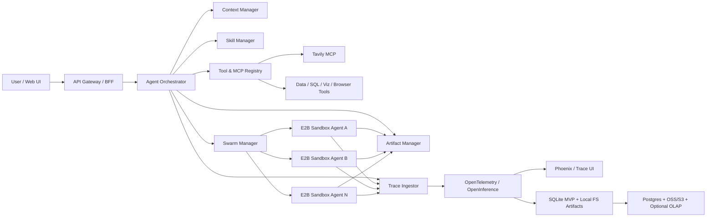
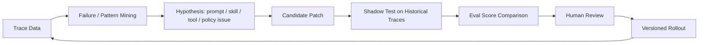

# DataSwarm 多 Agent 蜂群体系调研与设计

> 版本：v0.2  
> 日期：2026-06-08  
> 范围：产品定位、开源调研、架构设计、Web UI、Skill、Tool/MCP、E2B 沙箱蜂群、Trace/自进化数据底座。  
> 说明：本文不写实现代码。附件中的明文 API Key 不在本文扩散，后续应统一迁移到环境变量或密钥管理系统，并建议轮换已暴露密钥。  
> 当前状态：本文是 Original Vision / Research Baseline。当前工程事实与执行主线以 [DATASWARM_CANONICAL_PLAN.md](./DATASWARM_CANONICAL_PLAN.md) 为准。

## 1. 一句话定位

DataSwarm 是一个面向数据生产、分析、洞察、科学计算、因果推断、可视化与报告生成的一体化 Multi-Agent 平台：用户通过类似 Manus 的 Web UI 输入目标，主 Agent Orchestrator 负责理解、规划、路由、调用 Skills/Tools；当任务复杂或需要并行探索时，启动多个隔离沙箱中的 Agent 实例形成蜂群，分支执行后汇总、验证、生成可追踪的结果和 artifacts。

核心不是“多开几个聊天窗口”，而是构建一套可观测、可复盘、可自我改进的 agentic operating system。

## 1.1 已确认设计决策

- 主模型供应商：DMXAPI，优先按 OpenAI-compatible 协议接入；同时保留 Responses API 形式作为兼容路径。
- 主编排模型：`gpt-5.5-1m` 与 `claude-opus-4-8` 都作为 Orchestrator 可选主模型，并展示在 UI 模型选择器中。
- 沙箱内模型：继续使用 DeepSeek 官方 API，模型为 `deepseek-v4-pro` / `deepseek-v4-flash`。
- Runtime 策略：借鉴 OpenCode、Pi/OpenClaw、Hermes、CodeWhale 等 runtime 的设计，自研 DataSwarm Runtime。
- 数据存储：短期数据优先本地；artifact 与原始 payload 先存本地文件系统，未来可迁移到阿里云 OSS 或 AWS S3。
- 多用户/多租户：数据模型预留 tenant/user/project 字段，短期不实现完整多租户权限体系。
- 数据库路线：MVP 使用本地 SQLite；长期迁移到 Postgres；更远期按必要性拆分事务型数据库与 OLAP 分析型数据库。
- Web UI 技术栈：Next.js + TypeScript + Tailwind CSS。
- 报告生成：以 Markdown、HTML 为主，由沙箱负责生成、管理、维护；Office/PDF 类 artifact 暂不作为 MVP 主目标。

## 2. 互联网调研摘要

### 2.1 OpenCode

来源：[OpenCode 官网](https://opencode.ai/)、[OpenCode GitHub](https://github.com/anomalyco/opencode)、[Providers 文档](https://opencode.ai/docs/providers/)、[Agents 文档](https://opencode.ai/docs/agents)、[Tools 文档](https://dev.opencode.ai/docs/tools/)

关键点：

- OpenCode 是开源 coding agent，支持 terminal、IDE、desktop 三类入口。
- 其设计强调模型无关，使用 AI SDK 与 Models.dev 支持大量模型供应商，也支持本地模型。
- 支持多 session，并允许多个 agent 在同一项目并行工作。
- Agent 配置分为 primary agent 和 subagent；subagent 可由主 agent 自动调用，也可通过 `@agent` 手动调用。
- 每个 agent 可独立设置 prompt、model、permission，适合 DataSwarm 的“不同角色、不同模型、不同权限”设计。
- 内置工具包括 `bash`、`read`、`grep`、`glob`、`edit`、`write`、`apply_patch`、`skill`、`todowrite`、`webfetch`、`websearch`、`question` 等，给 DataSwarm 的工具权限模型提供了良好参照。

可借鉴：

- Agent 配置即产品能力：通过 JSON/YAML/Markdown 定义 agent persona、模型、权限。
- 将工具权限显式化，不同 agent 拥有不同 tool scope。
- “主 agent + subagent + child session”是蜂群执行的基础形态，但 DataSwarm 需要进一步把 child session 放入独立沙箱并接入全链路 Trace。

### 2.2 Oh My OpenCode

来源：[Oh My OpenCode 官网](https://ohmyopencode.com/)、[Oh My OpenCode Documentation](https://ohmyopencode.com/documentation/)

关键点：

- 它不是替代 OpenCode，而是 OpenCode 之上的 orchestration distribution。
- 重点能力包括 specialized agents、hooks、MCP、LSP、context window management、session recovery、auto-resume、directory-specific agents。
- 面向复杂仓库和多步骤工程任务，强调“开箱即用的默认编排”。

可借鉴：

- DataSwarm 可以采用“基础 Agent Runtime + Opinionated Distribution”的两层设计：底座保持通用，数据分析/因果推断/可视化/reporting 等能力以 profile、skill pack、agent pack 形式安装。
- Hooks 很重要：在 agent turn 前后、tool 调用前后、沙箱启动/关闭、artifact 生成、trace flush、context compaction 等节点挂载策略。
- 自动恢复与上下文压缩是长任务必备能力。

### 2.3 Pi / OpenClaw 底座

来源：[Pi GitHub](https://github.com/earendil-works/pi)、[OpenClaw Pi Integration Architecture](https://docs.openclaw.ai/pi)

关键点：

- Pi 是 agent harness mono repo，包含 `pi-ai`、`pi-agent-core`、`pi-coding-agent`、`pi-tui`。
- `pi-ai` 提供多供应商 LLM API 抽象；`pi-agent-core` 提供 tool calling 和 state management；`pi-coding-agent` 提供 coding agent CLI；`pi-tui` 提供 TUI。
- OpenClaw 的 Pi 集成不是简单启动子进程，而是直接导入并实例化 `AgentSession`，从而控制 session lifecycle、event handling、自定义工具注入、系统 prompt、session persistence、branching/compaction、auth profile failover、provider-agnostic model switching。

可借鉴：

- DataSwarm 应优先设计可嵌入的 `AgentSession` 合约，而不是只把 agent 当 CLI 子进程调用。
- Orchestrator 与 Sandbox Agent 之间应通过事件流和结构化 session API 通信。
- Session persistence、branching、compaction、auth profile rotation 是蜂群长任务的关键底座。
- 工具应支持 built-in tools 与 custom tools 分层，并且每个 channel/context 可注入不同工具。

### 2.4 DeepSeek-TUI / CodeWhale

来源：[CodeWhale GitHub](https://github.com/Hmbown/CodeWhale)、[DeepSeek 官方 awesome agent 集成说明](https://github.com/deepseek-ai/awesome-deepseek-agent/blob/main/docs/deepseek-tui.md)

关键点：

- 项目从 DeepSeek-TUI 演进为 CodeWhale，定位为 DeepSeek V4 terminal coding agent。
- 支持 DeepSeek V4 Pro / Flash，并具备 auto mode：先用轻量模型进行路由判断，再选择实际模型与 thinking level。
- 支持 approval gates、本地 workspace 编辑、reasoning block streaming、Rust 二进制分发、HTTP/SSE runtime API、MCP/ACP 接入等。
- 文档明确区分 Plan / Agent / YOLO 模式，以及审批强度。

可借鉴：

- DataSwarm 沙箱内可以采用“Flash 路由 + Pro 执行”的成本/质量平衡策略。
- Agent Runtime 需要暴露 HTTP/SSE 事件流，Web UI 不能靠 screen scraping terminal。
- 每个子 agent 应具备模式：Plan-only、Agent、Autonomous/YOLO，但 DataSwarm 默认不应开放无限权限。
- Thinking/tool stream 应被结构化输出到 UI 和 Trace，而不是只显示最终回答。

### 2.5 Hermes Agent

来源：[Hermes Agent GitHub](https://github.com/nousresearch/hermes-agent)

关键点：

- Hermes 定位为自改进 agent，强调 persistent memory、skills、messaging gateway、cron、toolsets、MCP、subagents、terminal backends。
- 文档中列出 Skills System、Memory、MCP Integration、Cron Scheduling、Context Files、Architecture、Security 等模块。
- 支持从 OpenClaw 迁移 settings、memories、skills、API keys、approval patterns、messaging settings、workspace instructions。

可借鉴：

- DataSwarm 的“自进化”不能只靠模型宣称，而要有闭环：Trace -> Failure/Eval -> Skill/Prompt/Policy Candidate -> Shadow Test -> Human Approval -> Versioned Rollout。
- Memory 与 Skill 要分开：Memory 是事实/偏好/历史，Skill 是可执行流程/方法论/资源包。
- 支持 messaging gateway 可作为后期扩展，但 MVP 先聚焦 Web UI。

### 2.6 Manus / OpenManus / AI-Manus 类 Web UI

来源：[Manus API Agents 文档](https://open.manus.im/docs/v2/agents-overview)、[Manus Browser Operator 文档](https://manus.im/docs/features/browser-operator)、[AI-Manus GitHub](https://github.com/Simpleyyt/ai-manus)、[OpenUI Artifacts 文档](https://www.openui.com/docs/chat/artifacts)

关键点：

- Manus API 将 agent、task、subtask 作为核心对象；subtask 可以像普通 task 一样发送消息、列消息、停止。
- Browser Operator 强调 agent 可在用户授权下操作浏览器，完成多步骤任务。
- AI-Manus 的模式是 Web -> Server -> Sandbox；Server 创建沙箱并返回 session id，沙箱内启动浏览器与文件/命令工具，Agent 处理期间通过 SSE 把事件回传 Web。
- OpenUI 的 Artifact 模式非常贴合需求：聊天流中展示 compact inline preview，点击后在右侧 side panel 展开完整内容。

可借鉴：

- DataSwarm Web UI 应以 `Conversation -> Task -> Run -> Step -> Artifact` 为核心信息架构。
- 工具调用、思考摘要、执行日志、artifact 不应混成纯文本，而应成为结构化 message parts。
- Artifact 需要双形态：聊天尾部的小图标/卡片，以及右侧预览面板。
- 子任务/子 agent 要在 UI 上可见：树状进度、分支状态、当前输出、成本、耗时、风险提醒。

### 2.7 E2B 沙箱

来源：[E2B Documentation](https://www.e2b.dev/docs)

关键点：

- E2B 提供按需创建的安全 Linux VM/Sandbox。
- 文档按 Quickstart、Examples、SDK Reference 三类组织，支持 agent 沙箱、desktop computer use、GitHub Actions 等使用场景。

可借鉴：

- DataSwarm 的蜂群执行应把 E2B 作为第一阶段默认沙箱供应商。
- 每个子任务启动一个 sandbox agent instance，带最小上下文、任务说明、工具白名单、数据挂载与预算。
- 沙箱应可快照、复用模板、预装 Python/R/Node、数据分析包、可视化工具、浏览器工具、DeepSeek agent runtime。

### 2.8 Tavily MCP

来源：[Tavily MCP 文档](https://docs.tavily.com/documentation/mcp)

关键点：

- Tavily MCP Server 允许 MCP client 使用 Tavily API。
- 支持 `tavily-search` 和 `tavily-extract`，提供实时 Web 搜索和网页抽取。
- Remote MCP URL 形态为 `https://mcp.tavily.com/mcp/?tavilyApiKey=<your-api-key>`。

可借鉴：

- DataSwarm 应将 Tavily 注册为默认 Web Research MCP，但 API Key 必须从密钥管理注入。
- Research 类型任务应默认使用 Search -> Extract -> Source Quality Check -> Citation Pack 的流程。
- 所有 Web 引用应进入 Trace 和 artifact source map，方便复核。

### 2.9 Trace / Observability

来源：[OpenTelemetry 文档](https://opentelemetry.io/docs/)、[Phoenix 文档](https://arize.com/docs/phoenix)、[LangSmith Observability 文档](https://docs.langchain.com/oss/python/langchain/observability)

关键点：

- OpenTelemetry 是 vendor-neutral 的开源观测框架，可生成、采集、导出 traces、metrics、logs。
- Phoenix 是开源 AI observability/evaluation 工具，基于 OpenTelemetry 和 OpenInference，支持 tracing、evaluation、prompt engineering、datasets & experiments。
- LangSmith 强调 agent trace 能记录模型调用、工具调用、决策点，用于 debug、evaluation、monitoring。

可借鉴：

- DataSwarm 的 Trace 不只是日志，而是自进化训练数据、评估数据、审计数据。
- 技术上建议采用 OTel + OpenInference 语义作为基础，避免被单一观测平台锁死。
- Phoenix 可作为早期本地/开源 Trace UI 与评估工作台；后续可扩展 ClickHouse/Tempo/Jaeger/Grafana/Langfuse/LangSmith。

## 3. DataSwarm 核心目标

### 3.1 产品目标

1. 一个入口：用户通过 Web UI 与主 Agent Orchestrator 交互。
2. 一体化 agentic 能力：支持 planning、tool calling、skill loading、memory、artifact generation、human review。
3. 蜂群执行：复杂任务拆成多个分支，在多个 E2B 沙箱中并行执行，每个沙箱内是一个实例化 agent。
4. 面向数据任务：从数据收集、清洗、建模、因果推断、可视化到报告生成形成端到端工作流。
5. 完整 Trace：记录用户、orchestrator、subagent、tool、sandbox、artifact、成本、延迟、失败、评估、修复建议。
6. 可扩展 Skills：用户可读取、使用、创建、安装、版本化、分享 skills。
7. 可审计与安全：沙箱隔离、工具权限、密钥最小暴露、人类确认、数据脱敏。

### 3.2 非目标

- 第一阶段不做完全自主的无人监管生产系统。
- 第一阶段不把所有开源 agent runtime 全部兼容，只设计 adapter contract。
- 第一阶段不追求通用办公自动化全渠道，先聚焦 Web UI + 数据/研发/分析任务。
- 不把 chain-of-thought 原文作为产品卖点；UI 展示“思考摘要/执行摘要/决策理由”，Trace 内保存可合规审计的结构化推理事件和模型响应元数据。

## 4. 推荐总体架构



### 4.1 核心模块

**Web UI**

- 对话列表、项目/分组、技能、模型选择、附件上传、上下文进度、执行流、artifact 面板。
- 技术栈建议为 Next.js + TypeScript + Tailwind CSS，优先保证长期可维护性、组件生态和交互迭代速度。
- 使用 SSE/WebSocket 接收 run events。
- message part 类型包括 text、summary、tool_call、tool_result、thinking_summary、artifact_preview、sandbox_event、trace_link、approval_request。

**API Gateway / BFF**

- 认证、项目权限、上传、conversation/task/run API。
- 对 UI 屏蔽底层 agent runtime 差异。
- 支持流式事件转发、断线重连、消息补偿。

**Agent Orchestrator**

- 入口 agent，负责理解用户意图、选择模型、读取上下文、选择技能、调用工具、决定是否启用 swarm。
- 主模型通过 DMXAPI 接入，`gpt-5.5-1m` 与 `claude-opus-4-8` 都作为主编排模型 profile；调用层优先抽象成 OpenAI-compatible client。
- Orchestrator 不直接做所有工作，而是决定“自己执行、调用工具、调用单个 specialist、启动 swarm、请求用户确认”。

**Context Manager**

- 管理 project context、conversation memory、uploaded files、AGENTS.md/项目规则、skill metadata、trace-derived memory。
- 支持 compaction、source map、上下文预算。
- 对子 agent 下发的是任务所需的最小上下文包，而不是整段会话。

**Skill Manager**

- 管理 skill 注册、发现、安装、版本、权限、依赖、启用范围。
- Skill 格式建议兼容 Agent Skills：每个 skill 是文件夹 bundle，至少包含 `SKILL.md`，可包含脚本、模板、API specs、示例、资源。

**Tool & MCP Registry**

- 统一注册内置工具、MCP 工具、自定义工具。
- 每个 tool 有 schema、权限、风险等级、审计策略、成本标签、速率限制。
- Tavily MCP 作为默认 Web Research 工具。

**Swarm Manager**

- 负责复杂任务拆分、子任务分派、沙箱创建、agent 实例启动、进度聚合、结果合并、冲突解决。
- 支持 map-reduce、debate、parallel exploration、reviewer-verifier、race-and-rank 等蜂群模式。

**Artifact Manager**

- 管理 markdown、HTML、图片、图表、notebook、CSV/XLSX、报告、代码、日志、模型输出；MVP 报告 artifact 以 Markdown/HTML 为主，由沙箱负责生成与维护。
- 每个 artifact 有 type、mime、storage_uri、preview metadata、source trace、生成 agent、版本。

**Trace Ingestor**

- 全量采集用户行为、agent 行为、tool calls、sandbox events、artifacts、cost、latency、eval labels。
- 对敏感信息做 redaction、hash、分级存储。

## 5. Agent Orchestrator 设计

### 5.1 Orchestrator 职责

1. 解析用户目标：任务类型、数据源、交付物、约束、风险。
2. 生成执行策略：单 agent、specialist handoff、swarm、human clarification。
3. 选择模型：主编排模型、快速路由模型、沙箱模型、review 模型。
4. 选择技能：根据 intent、project、文件类型、历史成功记录选择 skills。
5. 选择工具：Tavily、文件、代码执行、SQL、notebook、可视化、浏览器、报告生成等。
6. 管理上下文：构造最小上下文包并做 compaction。
7. 汇总结果：对子 agent 输出做一致性检查、证据校验、artifact 归档。
8. 写入 Trace：每一步产生结构化事件。

### 5.2 模型路由建议

**主入口 Orchestrator**

- 默认候选：DMXAPI `gpt-5.5-1m`，用于长上下文、复杂规划、结果综合。
- Claude 候选：DMXAPI `claude-opus-4-8`，与 GPT profile 使用同一套 DMXAPI/OpenAI-compatible 调用抽象。
- UI 展示：`gpt-5.5-1m`、`claude-opus-4-8`、`deepseek-v4-pro`、`deepseek-v4-flash`；内部可以对不同任务设置推荐默认值。
- 用途：任务理解、规划、分派、结果综合、关键决策。

**沙箱 Agent**

- `deepseek-v4-flash`：快速路由、轻量探索、数据预览、检索、草稿、并行宽搜。
- `deepseek-v4-pro`：复杂实现、深度分析、建模、因果推断、重要结论撰写。
- 自动路由：先用 Flash 判断复杂度、风险和所需 thinking level，再决定是否升级 Pro。

**Reviewer / Verifier**

- 可使用与执行 agent 不同的模型，降低同源错误。
- 对关键数据结论、统计方法、因果推断、财务/医疗/法律类高风险结论必须触发 reviewer。

### 5.3 是否启动 Swarm 的判断

触发条件：

- 任务可并行拆分，如多数据源调研、多假设验证、多模型对比、多图表探索。
- 用户目标模糊，需要多个方案探索后汇总。
- 任务预计耗时超过阈值，如 3 分钟或 5 个以上工具步骤。
- 需要交叉验证，如数据分析结论、因果推断、科学计算。
- 需要生成多个 artifacts，如 dashboard + report + notebook + summary。

不触发条件：

- 简单问答、单文件摘要、明确的小工具调用。
- 涉及敏感权限且用户尚未授权。
- 预算不足或上下文不足。

## 6. Swarm 蜂群执行模式

### 6.1 推荐蜂群模式

**Map-Reduce**

- Orchestrator 拆分多个子问题。
- 子 agent 并行产出部分结果。
- Reducer agent 汇总，Verifier agent 检查。
- 适合市场调研、多来源资料整理、数据分区分析。

**Explore-Exploit**

- 多个 Explorer agent 快速探索不同路径。
- Orchestrator 根据 trace/cost/quality 选择少数路径深入。
- 适合模糊任务、科学计算方案选择、可视化风格探索。

**Debate + Judge**

- 多个 agent 基于不同假设给出结论。
- Judge agent 按证据、统计质量、可复现性评分。
- 适合因果推断、策略洞察、复杂业务判断。

**Builder + Reviewer + Fixer**

- Builder 生成结果。
- Reviewer 找问题。
- Fixer 修复。
- Verifier 复核。
- 适合报告生成、代码/SQL/notebook 生成、模型实验。

**Race-and-Rank**

- 多个 agent 独立完成同一任务。
- Judge 按评估标准选择最优结果或融合。
- 适合高价值交付物和模型不稳定任务。

### 6.2 子 Agent 运行单元

每个沙箱内 agent instance 应包含：

- `agent_id`、`run_id`、`parent_run_id`、`sandbox_id`。
- `task_contract`：目标、输入、输出格式、禁止事项、预算、deadline。
- `context_bundle`：必要文件、历史摘要、引用、skill metadata。
- `model_profile`：DeepSeek Pro/Flash、thinking level、temperature、max tokens。
- `tool_policy`：允许的工具、审批策略、网络权限、文件权限。
- `trace_exporter`：向 Trace Ingestor 发送事件。
- `artifact_uploader`：生成结果后上传 Artifact Manager。

### 6.3 E2B 沙箱策略

- 使用 E2B 作为默认 cloud sandbox。
- API Key 使用 `E2B_API_KEY` 环境变量注入，不进入 prompt，不写入 trace。
- 建议维护 DataSwarm 专用 E2B template：
  - Python、R、Node、Git、ripgrep、ffmpeg、pandoc。
  - pandas、numpy、scipy、statsmodels、scikit-learn、matplotlib、seaborn、plotly、causalinference/dowhy/econml 等。
  - DeepSeek sandbox agent runtime。
  - Tavily MCP client 配置。
  - trace exporter。
- 沙箱生命周期：
  1. create sandbox
  2. mount/upload context bundle
  3. inject env and tool policy
  4. start sandbox agent
  5. stream events
  6. collect artifacts
  7. snapshot optional
  8. terminate or hibernate

## 7. Skill 体系设计

### 7.1 Skill 定义

Skill 是可复用的专业能力包，建议结构：

```text
skills/
  causal-inference/
    SKILL.md
    scripts/
    templates/
    examples/
    references/
    skill.json
```

`SKILL.md` 包含：

- name、description、when_to_use。
- 输入要求。
- 工作流程。
- 可调用脚本说明。
- 输出 artifact 类型。
- 风险与验证要求。

`skill.json` 可选，包含机器可读元数据：

- version、author、tags、domain、dependencies。
- required_tools、required_permissions。
- model_preferences。
- evaluation_criteria。

### 7.2 Skill 生命周期

1. Discover：根据用户意图、文件类型、项目上下文发现候选 skill。
2. Load：只加载 metadata 和摘要，避免 prompt bloating。
3. Inspect：需要时再读取 `SKILL.md` 和具体资源。
4. Execute：通过脚本/工具/agent workflow 执行。
5. Trace：记录 skill 版本、输入、输出、耗时、失败点。
6. Evaluate：按 skill 自带标准或平台标准评分。
7. Improve：从失败 trace 生成改进候选，进入人工审批。

### 7.3 首批内置 Skill Pack

- Web Research：Tavily search/extract、来源质量评估、引用包。
- Data Profiling：读取 CSV/XLSX/SQL，生成 schema、缺失值、分布、异常。
- SQL Analyst：生成 SQL、校验、执行、解释。
- Python Data Analysis：notebook 风格分析、图表、结论。
- Causal Inference：DAG 假设、混杂识别、PSM/DID/IV/RDD 方法建议。
- Scientific Computing：数值计算、仿真、误差分析。
- Visualization：图表选择、Plotly/Matplotlib、dashboard artifact。
- Report Generation：Markdown/HTML 报告、executive summary、可复现步骤和 artifact 索引。
- Artifact Review：检查报告完整性、引用、图表、数据口径。
- Trace Debugger：基于失败 trace 分析问题原因。

### 7.4 Skill 安装与管理

UI 需要提供：

- 已安装技能列表。
- 技能详情、版本、来源、权限。
- 启用/禁用。
- 项目级 skill override。
- 从 Git URL、本地目录、官方 registry 安装。
- 创建 skill 向导：从一次成功任务生成 skill draft。

## 8. Tool / MCP 注册体系

### 8.1 默认工具层

**基础工具**

- file read/write/edit。
- shell/code execution。
- search/grep/glob。
- todo/progress。
- artifact create/update。

**数据工具**

- CSV/XLSX reader。
- SQL connector。
- Python/R execution。
- notebook builder。
- chart renderer。

**Web 工具**

- Tavily MCP：默认 search/extract。
- 浏览器工具：后续接 browser-use / Playwright / E2B desktop。

**治理工具**

- approval request。
- secret redaction。
- cost check。
- policy check。
- trace query。

### 8.2 MCP 注册建议

每个 MCP server 记录：

- server id、display name、transport、URL/command。
- auth method。
- tool list snapshot。
- risk level。
- allowlist projects。
- default parameters。
- session/user attribution。

Tavily 示例：

- `server_label`: `tavily`
- `server_url`: `https://mcp.tavily.com/mcp/?tavilyApiKey=${TAVILY_API_KEY}`
- default tools：`tavily-search`、`tavily-extract`
- 默认策略：research tasks 可用；涉及付费高频抓取时提示预算。

## 9. Trace 体系设计

### 9.1 Trace 的目标

DataSwarm 的 Trace 是四类数据的统一来源：

1. Debug：为什么失败、卡住、幻觉、工具误用。
2. Audit：谁在何时做了什么、访问了什么数据、生成了什么结果。
3. Evaluation：输出质量、任务完成率、成本、延迟、用户反馈。
4. Self-Evolution：从失败和成功轨迹中改进 prompts、skills、tools、policies、routing。

### 9.2 Trace 数据模型

核心对象：

- `conversation`
- `task`
- `run`
- `agent`
- `span`
- `event`
- `tool_call`
- `model_call`
- `sandbox_session`
- `artifact`
- `approval`
- `eval_result`
- `cost_record`

推荐 span taxonomy：

- `agent.run`
- `agent.plan`
- `agent.handoff`
- `swarm.spawn`
- `sandbox.create`
- `model.call`
- `tool.call`
- `mcp.call`
- `skill.load`
- `skill.execute`
- `context.compact`
- `artifact.generate`
- `artifact.review`
- `human.approval`
- `eval.score`

### 9.3 必须记录的字段

每个 span：

- `trace_id`、`span_id`、`parent_span_id`
- `run_id`、`agent_id`、`conversation_id`
- `span_kind`
- `started_at`、`ended_at`
- `status`
- `input_summary`
- `output_summary`
- `model`
- `tool_name`
- `tokens_in`、`tokens_out`
- `cost_estimate`
- `latency_ms`
- `artifact_ids`
- `error_code`、`error_message`
- `redaction_status`

敏感字段：

- 原始 prompt、工具输入、工具输出、文件片段、网页内容需要按数据策略分级存储。
- 密钥、cookie、token、个人隐私字段必须 redaction。
- Trace UI 默认展示摘要，授权用户才能查看原始 payload。

### 9.4 Trace 存储建议

MVP：

- SQLite：核心对象、关系、查询，适合本地优先的 MVP 验证。
- Local File System：原始 payload、artifacts、large logs。
- OpenTelemetry Collector：统一采集。
- Phoenix：LLM trace UI、eval、prompt iteration。

长期：

- Postgres：替代 SQLite 承担事务型数据、关系查询、多用户/多项目隔离。
- 阿里云 OSS / AWS S3：替代本地文件系统承载 artifacts、原始 payload、报告、日志包。

更远期：

- 按必要性拆分 OLTP 与 OLAP，避免过早复杂化。
- ClickHouse：高吞吐事件与成本分析。
- Tempo/Jaeger：分布式 trace 查询。
- Grafana：系统指标。
- 自研 Trace Workbench：面向 agent 自进化的 replay、diff、repair。

### 9.5 自进化闭环



自进化严禁直接在线改生产规则。必须有：

- candidate version。
- historical trace replay。
- eval improvement。
- regression check。
- human approval。
- rollback。

## 10. Web UI 产品设计

### 10.1 布局

技术栈：

- Next.js + TypeScript + Tailwind CSS。
- 组件层建议使用可维护的 headless/component primitives，保持 artifact panel、message parts、tool cards、swarm tree 等复杂交互可组合。
- 实时通信用 SSE 起步，后续在需要双向协作或多人实时状态时升级 WebSocket。

左侧 Sidebar：

- 新建对话。
- 对话列表。
- 项目/分组。
- Skills。
- Artifacts。
- Trace/History。
- 设置。

中间主区域：

- Conversation stream。
- Agent 状态条。
- 子任务树/蜂群进度。
- 消息内容、工具调用、摘要、approval request。

底部 Composer：

- 多行输入。
- 附件上传。
- 模型选择：默认显示 `gpt-5.5-1m` / `claude-opus-4-8` / `deepseek-v4-pro` / `deepseek-v4-flash`。
- 模式选择：Chat / Agent / Swarm。
- 上下文进度：token、文件、skills、tools、预算。
- 发送、停止、继续、压缩上下文。

右侧 Artifact Panel：

- 点击 artifact icon 后打开。
- 支持 Markdown、HTML、图片、CSV/XLSX、PDF、Notebook、Chart、Log、Trace。
- 提供下载、复制、版本切换、来源 trace、重新生成、请求审查。

### 10.2 Conversation Message Parts

建议消息不是纯 Markdown，而是结构化 parts：

- `assistant_text`
- `thinking_summary`
- `plan`
- `tool_call`
- `tool_result`
- `sandbox_event`
- `swarm_status`
- `artifact_preview`
- `summary`
- `approval_request`
- `error`

对用户可见策略：

- 默认展示高层推理摘要和执行证据。
- 工具调用可折叠。
- 长日志自动压缩。
- 重要 artifact 固定在 assistant 回复尾部。

### 10.3 Swarm 可视化

必须让用户知道“多个 agent 在做什么”：

- 子任务树：agent name、模型、状态、耗时、成本。
- 每个子 agent 的最近动作。
- 分支输出摘要。
- 冲突/分歧提示。
- 最终 merge reason。

### 10.4 Manus-like 但更适合 DataSwarm

Manus 类界面的关键价值是把“聊天、执行、浏览器/文件、artifact”放在一个连续工作台里。DataSwarm 应进一步强化：

- 数据对象面板：数据集、schema、字段、样本。
- 方法论面板：使用了哪个统计/因果/科学计算 skill。
- 证据面板：引用、SQL、notebook cell、图表来源。
- Trace 面板：任务为何这么做、失败在哪里、如何改进。

## 11. 数据分析与科学计算工作流

### 11.1 标准数据任务流程

1. 用户上传数据或提供数据源。
2. Orchestrator 做任务识别与数据风险判断。
3. Data Profiling skill 生成初步画像。
4. Swarm 并行：
   - Agent A 做数据质量。
   - Agent B 做探索性分析。
   - Agent C 做建模/统计检验。
   - Agent D 做可视化方案。
5. Reviewer 检查口径、统计显著性、潜在偏差。
6. Artifact Manager 生成 report、charts、notebook、data summary。
7. Trace 记录完整流程。

### 11.2 因果推断任务流程

1. 明确 treatment、outcome、unit、time、population。
2. 构建或询问 DAG/业务假设。
3. 识别混杂、选择偏差、测量误差。
4. 方法推荐：PSM、DID、IV、RDD、synthetic control、panel model 等。
5. 多 agent 并行验证不同方法假设。
6. 输出结论必须包含：
   - 识别假设。
   - 不可验证假设。
   - 数据限制。
   - 稳健性检查。
   - 不应做的因果解释。

### 11.3 报告生成工作流

报告生成由沙箱内 agent 负责实际创建、修改、维护，并通过 Artifact Manager 回传到主工作台。MVP 优先支持 Markdown 与 HTML，两者都要带 source trace 和可复现步骤；PDF、PPTX、DOCX、XLSX 可作为后续扩展。

输出 artifact：

- `analysis_report.md`
- `analysis_report.html`
- `charts/`
- `notebook.ipynb`
- `data_profile.json`
- `methodology.md`
- `sources.json`
- `trace_summary.json`

报告必须包含：

- Executive summary。
- 数据来源与处理。
- 方法。
- 主要发现。
- 图表。
- 风险/限制。
- 可复现步骤。
- 引用与证据。

## 12. 安全、权限与密钥

### 12.1 密钥处理

附件和用户消息中已经出现多组明文 Key。建议：

- 立即轮换已暴露 Key。
- 后续只使用环境变量：
  - `DMX_API_KEY`
  - `DEEPSEEK_API_KEY`
  - `E2B_API_KEY`
  - `TAVILY_API_KEY`
- UI、Trace、日志、artifact 中永不显示完整密钥。
- Tool call 输入输出进入 Trace 前做 secret scanning。

### 12.2 沙箱权限

- 默认最小权限。
- 网络访问可按任务开启。
- 文件系统只挂载任务需要的 context bundle。
- 用户上传数据和项目文件分级授权。
- 高风险工具需要 approval。
- 每个子 agent 有预算、时间、工具次数限制。

### 12.3 Human-in-the-loop

必须请求确认的场景：

- 访问外部私有系统。
- 执行付费/高频 API 调用。
- 删除/覆盖重要文件。
- 发布、发送邮件、提交 PR、对外输出。
- 使用敏感数据生成公开 artifact。

## 13. MVP 路线

### Phase 0：设计与骨架

- 确定对象模型：conversation/task/run/agent/span/artifact/skill/tool。
- 确定 provider profiles：DMX `gpt-5.5-1m`、DMX `claude-opus-4-8`、DeepSeek Pro/Flash。
- 建立本地 SQLite schema 与本地 artifact 目录规范，同时预留 tenant/user/project 字段。
- 确定 E2B template 需求。
- 确定 Trace schema。

### Phase 1：单 Agent Web 工作台

- Web UI：Next.js + TypeScript + Tailwind CSS，实现 Sidebar、Conversation、Composer、Artifact Panel。
- Orchestrator 单 agent run。
- Tavily MCP 注册。
- Skill Manager 读取本地 skills。
- Artifact Manager 支持 Markdown/HTML/图片/CSV，报告以沙箱生成的 Markdown/HTML 为主。
- OTel + Phoenix Trace。

### Phase 2：Sandbox Agent

- E2B sandbox 启动。
- 沙箱内 DeepSeek agent runtime。
- SSE 事件回传。
- 文件/context bundle 上传。
- artifact 回收。
- 基础权限/预算控制。

### Phase 3：Swarm

- Swarm Manager。
- 并行子任务。
- 子任务树 UI。
- reducer/reviewer。
- Map-Reduce、Builder-Reviewer-Fixer 两种模式。

### Phase 4：数据分析 Skill Pack

- Data Profiling。
- Python Analysis。
- Visualization。
- Report Generation。
- SQL Analyst。
- Causal Inference beta。

### Phase 5：自进化闭环

- Trace mining。
- Failure classifier。
- Skill/prompt candidate generator。
- Historical replay eval。
- 人工审批与版本发布。

## 14. 关键设计决策建议

1. 先做“可嵌入 AgentSession 合约”，不要只封装 CLI。
2. Web UI 以事件流驱动，所有 agent 输出都结构化。
3. Skill 与 Tool 分离：Skill 是方法和流程，Tool 是外部能力。
4. Trace 从第一天开始做，不要等功能完成后补。
5. 蜂群不是默认并行，必须由 Orchestrator 基于复杂度、预算、风险触发。
6. 沙箱 agent 接收最小上下文，避免上下文污染和成本爆炸。
7. 所有 artifacts 都要有 source trace。
8. 自进化必须走评估与审批，不允许直接在线自改。

## 15. 已关闭决策与后续开放问题

已关闭决策：

- `gpt-5.5-1m` 与 `claude-opus-4-8` 都来自 DMXAPI，调用层优先采用 OpenAI-compatible 协议，保留 Responses API 作为兼容路径。
- `gpt-5.5-1m` 与 `claude-opus-4-8` 都作为主模型候选，并展示在 UI 模型选择器中。
- 不直接兼容某个现有 runtime；借鉴 OpenCode、Pi/OpenClaw、Hermes、CodeWhale，自研 DataSwarm Runtime。
- 数据短期本地优先，未来 artifact/payload 存储可迁移到阿里云 OSS 或 AWS S3。
- 数据模型预留多用户、多租户字段，短期不实现完整多租户。
- MVP 使用 SQLite；长期迁移 Postgres；更远期按必要性拆分事务数据库和 OLAP 分析数据库。
- Web UI 使用 Next.js + TypeScript + Tailwind CSS。
- 报告生成以 Markdown、HTML 为主，由沙箱生成、管理和维护。

后续开放问题：

- UI 中 `gpt-5.5-1m` 与 `claude-opus-4-8` 的默认排序、推荐场景和预算提示。
- SQLite schema 是否从第一版就按未来 Postgres 迁移设计完整 migration 体系。
- OSS/S3 对象命名、版本、加密、生命周期策略。
- 多用户/多租户字段的最小集合：`tenant_id`、`user_id`、`project_id`、`workspace_id` 是否全部保留。
- HTML 报告是否需要沙箱内自动截图生成封面/预览图。

## 16. 参考来源

- [OpenCode 官网](https://opencode.ai/)
- [OpenCode GitHub](https://github.com/anomalyco/opencode)
- [OpenCode Providers](https://opencode.ai/docs/providers/)
- [OpenCode Agents](https://opencode.ai/docs/agents)
- [OpenCode Tools](https://dev.opencode.ai/docs/tools/)
- [Oh My OpenCode](https://ohmyopencode.com/)
- [Oh My OpenCode Documentation](https://ohmyopencode.com/documentation/)
- [Pi GitHub](https://github.com/earendil-works/pi)
- [OpenClaw Pi Integration Architecture](https://docs.openclaw.ai/pi)
- [CodeWhale / DeepSeek-TUI GitHub](https://github.com/Hmbown/CodeWhale)
- [DeepSeek awesome agent: DeepSeek-TUI](https://github.com/deepseek-ai/awesome-deepseek-agent/blob/main/docs/deepseek-tui.md)
- [Hermes Agent GitHub](https://github.com/nousresearch/hermes-agent)
- [Manus API Agents](https://open.manus.im/docs/v2/agents-overview)
- [Manus Browser Operator](https://manus.im/docs/features/browser-operator)
- [AI-Manus GitHub](https://github.com/Simpleyyt/ai-manus)
- [OpenUI Artifacts](https://www.openui.com/docs/chat/artifacts)
- [E2B Documentation](https://www.e2b.dev/docs)
- [Tavily MCP Documentation](https://docs.tavily.com/documentation/mcp)
- [OpenTelemetry Documentation](https://opentelemetry.io/docs/)
- [Phoenix Documentation](https://arize.com/docs/phoenix)
- [LangSmith Observability](https://docs.langchain.com/oss/python/langchain/observability)
- [AGENTS.md](https://agents.md/)
- [OpenAI Agents SDK](https://developers.openai.com/api/docs/guides/agents)
- [OpenAI: Skills and hosted computer environment](https://openai.com/index/equip-responses-api-computer-environment/)
