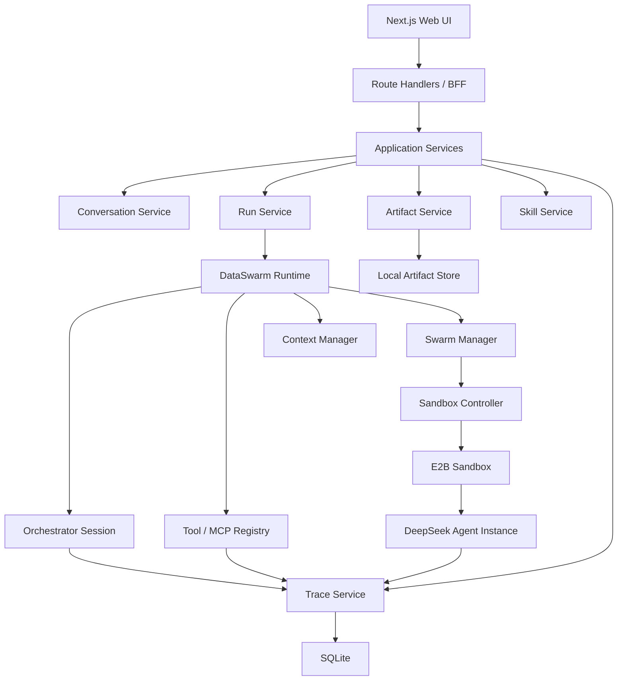
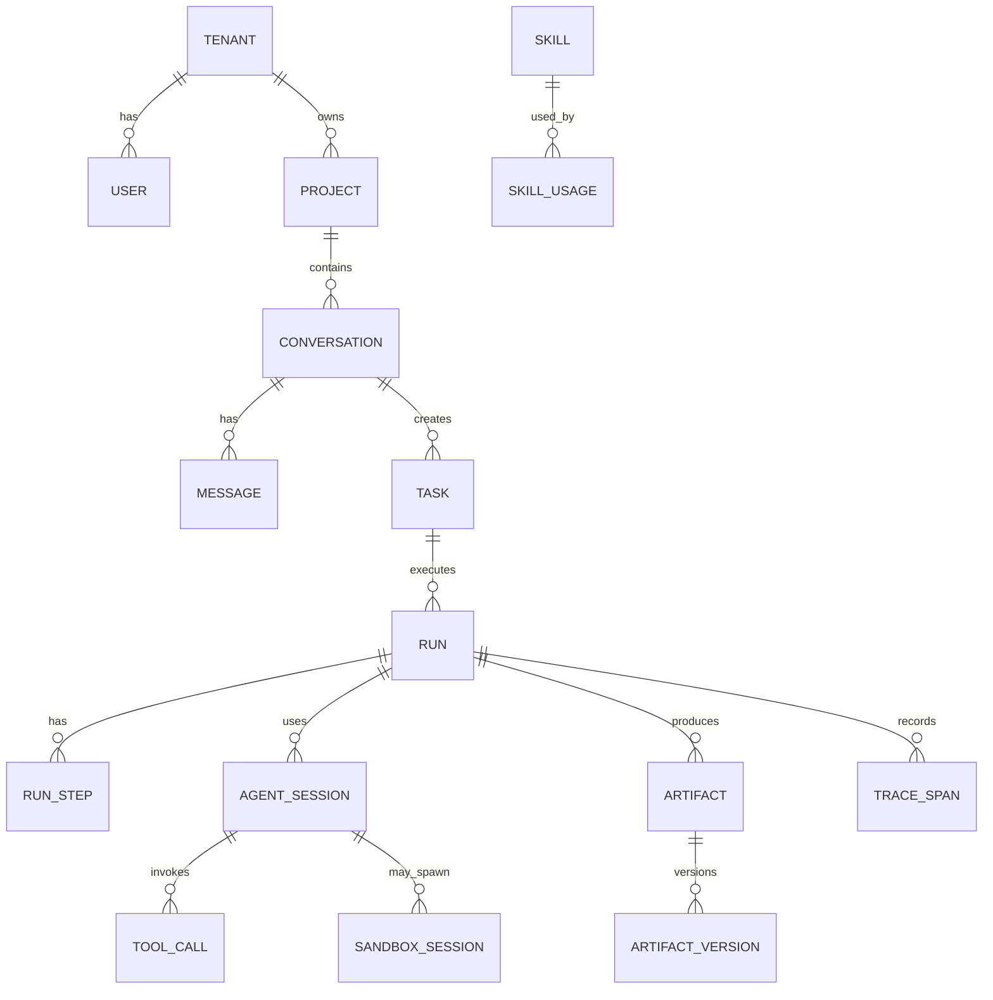
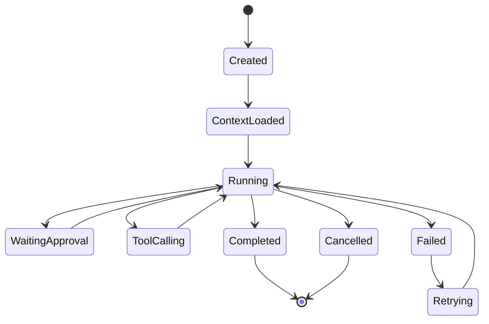
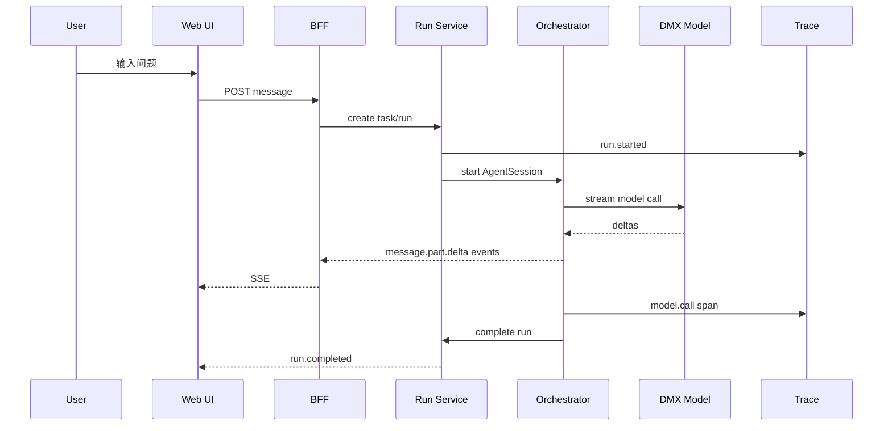
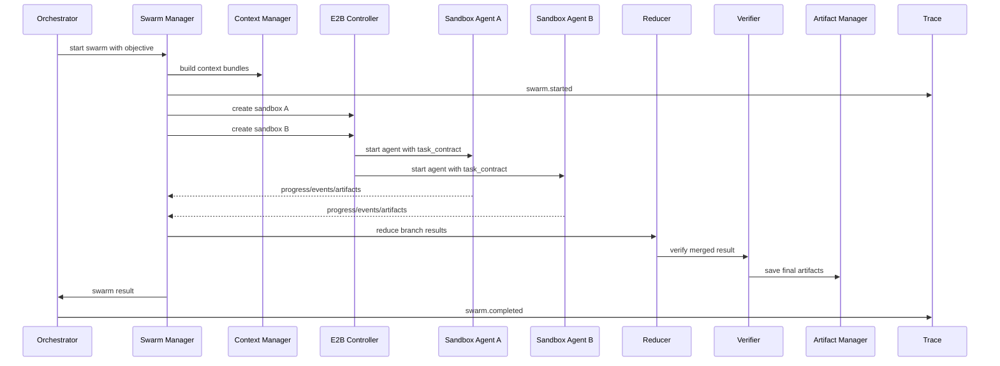

# DataSwarm 技术设计、执行路径与验证方案

> 版本：v0.1  
> 日期：2026-06-08  
> 前置文档：[DataSwarm多Agent蜂群体系调研与设计.md](./DataSwarm多Agent蜂群体系调研与设计.md)  
> 范围：详细技术架构、模块边界、数据模型、API/事件协议、Agent Runtime、Swarm 沙箱执行、Trace、自进化、测试验证和里程碑。  
> 原则：本文仍不写实现代码，但要达到可直接进入工程实现拆解的粒度。  
> 当前状态：本文是 Original Execution Baseline。当前实现状态、V2 主线和后续阶段以 [DATASWARM_CANONICAL_PLAN.md](./DATASWARM_CANONICAL_PLAN.md) 为准。

## 1. 架构目标

DataSwarm 的第一版要解决四个工程核心问题：

1. 用户通过 Web UI 发起任务，系统能稳定创建 conversation/task/run，并持续流式回传执行状态。
2. Orchestrator 能用 DMXAPI 主模型完成规划、工具调用、Skill 选择、单 Agent 执行和复杂任务分派。
3. Swarm Manager 能按任务合同启动 E2B 沙箱，每个沙箱内运行一个 DeepSeek Agent 实例，并把事件、结果、artifact 回传。
4. Trace 从第一天贯穿全链路，支持调试、审计、评估和后续自进化。

第一阶段的底线不是“模型多聪明”，而是“每一步都可观察、可中断、可恢复、可验证”。

## 2. 总体技术栈

### 2.1 前端与 BFF

- Next.js App Router。
- TypeScript。
- Tailwind CSS。
- SSE 作为 MVP 实时通道；WebSocket 作为后续多人协作和双向控制扩展。
- Route Handlers 负责 chat/run streaming、artifact preview、file upload 等 API。
- Server Components 负责初始数据读取和页面骨架，交互组件尽量下沉为 Client Components。

Next.js 实现约束：

- 数据库、对象存储、模型 SDK、E2B SDK、MCP client 必须懒初始化，避免 build 阶段读取环境变量导致失败。
- 大文件上传、SSE streaming、模型调用、沙箱控制使用 Route Handlers，不放进 Server Actions。
- UI 状态不以纯文本消息为中心，而以 typed message parts 和 run events 为中心。

### 2.2 Agent 与模型层

- DMXAPI：主编排模型 provider。
  - `gpt-5.5-1m`
  - `claude-opus-4-8`
- DeepSeek 官方 API：沙箱 Agent provider。
  - `deepseek-v4-pro`
  - `deepseek-v4-flash`
- 模型调用统一封装为 `ModelProvider` 抽象，外部调用方不直接依赖某个 SDK。
- 若使用 Vercel AI SDK，需要先确认 AI SDK v6 的实际 API 签名；MVP 也可以先用 OpenAI-compatible HTTP client 实现 DMXAPI/DeepSeek provider，以降低早期不确定性。

### 2.3 存储

MVP：

- SQLite：事务性元数据。
- 本地文件系统：uploads、artifacts、trace payload、sandbox bundles。

长期：

- Postgres 替代 SQLite。
- 阿里云 OSS / AWS S3 替代本地 artifact store。

更远期：

- ClickHouse 或其他 OLAP 存储承载高吞吐 Trace/Event 分析。

### 2.4 沙箱与工具

- E2B：默认沙箱供应商。
- Tavily MCP：默认 Web Research 工具。
- 本地内置工具：文件、artifact、代码执行、数据读取、图表渲染、approval、trace query。
- Tool Registry 统一管理工具 schema、权限、风险等级、调用审计。

## 3. 逻辑分层



### 3.1 推荐目录结构

```text
dataswarm/
  apps/
    web/
      src/app/
      src/components/
      src/features/
      src/lib/
  packages/
    runtime/
    models/
    tools/
    skills/
    swarm/
    trace/
    storage/
    shared/
  skills/
    web-research/
    data-profiling/
    python-analysis/
    visualization/
    report-generation/
  sandbox/
    agent/
    templates/
  data/
    dataswarm.sqlite
    uploads/
    artifacts/
    traces/
    sandbox-bundles/
```

说明：

- `apps/web` 承载 Next.js UI 和 BFF。
- `packages/runtime` 承载 AgentSession、RunLoop、event bus、hooks。
- `packages/models` 承载 DMXAPI/DeepSeek provider。
- `packages/tools` 承载 tool registry、tool executor、MCP adapter。
- `packages/swarm` 承载 Swarm Manager、task splitter、reducer、sandbox orchestration。
- `packages/trace` 承载 trace schema、redaction、exporter、query。
- `sandbox/agent` 是沙箱内运行的轻量 agent runtime。

## 4. 核心对象模型

### 4.1 概念关系



### 4.2 SQLite 表设计

所有表 MVP 阶段都预留：

- `tenant_id`
- `user_id`
- `project_id`
- `created_at`
- `updated_at`

短期这些字段可使用默认值，但不要省略，避免未来迁移痛苦。

**tenants**

- `id`
- `name`
- `plan`
- `metadata_json`

**users**

- `id`
- `tenant_id`
- `display_name`
- `email`
- `role`
- `settings_json`

**projects**

- `id`
- `tenant_id`
- `owner_user_id`
- `name`
- `description`
- `local_root`
- `settings_json`

**conversations**

- `id`
- `tenant_id`
- `project_id`
- `user_id`
- `title`
- `status`
- `default_model`
- `context_summary`
- `metadata_json`

**messages**

- `id`
- `conversation_id`
- `run_id`
- `role`
- `parts_json`
- `status`
- `created_by_agent_id`
- `token_count`
- `metadata_json`

`parts_json` 是核心。消息内容必须结构化，而不是只存 Markdown。

**tasks**

- `id`
- `conversation_id`
- `parent_task_id`
- `title`
- `objective`
- `task_type`
- `status`
- `priority`
- `risk_level`
- `input_refs_json`
- `acceptance_criteria_json`
- `metadata_json`

**runs**

- `id`
- `task_id`
- `conversation_id`
- `mode`
- `status`
- `model_profile`
- `started_at`
- `ended_at`
- `budget_json`
- `result_summary`
- `error_json`

`mode` 可取：

- `chat`
- `agent`
- `swarm`
- `review`
- `replay`

**run_steps**

- `id`
- `run_id`
- `parent_step_id`
- `step_type`
- `status`
- `title`
- `input_summary`
- `output_summary`
- `started_at`
- `ended_at`
- `trace_span_id`
- `metadata_json`

**agent_sessions**

- `id`
- `run_id`
- `parent_agent_session_id`
- `agent_role`
- `agent_name`
- `model_profile`
- `status`
- `instructions_hash`
- `context_bundle_id`
- `tool_policy_json`
- `metadata_json`

**sandbox_sessions**

- `id`
- `run_id`
- `agent_session_id`
- `provider`
- `external_sandbox_id`
- `status`
- `template`
- `started_at`
- `ended_at`
- `resource_limits_json`
- `env_policy_json`
- `metadata_json`

**artifacts**

- `id`
- `run_id`
- `conversation_id`
- `producer_agent_session_id`
- `type`
- `mime_type`
- `title`
- `current_version_id`
- `storage_uri`
- `preview_uri`
- `source_trace_id`
- `metadata_json`

**artifact_versions**

- `id`
- `artifact_id`
- `version`
- `storage_uri`
- `content_hash`
- `created_by_agent_session_id`
- `change_summary`
- `metadata_json`

**skills**

- `id`
- `name`
- `version`
- `source`
- `path`
- `description`
- `tags_json`
- `required_tools_json`
- `permissions_json`
- `status`
- `metadata_json`

**skill_usages**

- `id`
- `skill_id`
- `run_id`
- `agent_session_id`
- `status`
- `input_summary`
- `output_summary`
- `trace_span_id`
- `metadata_json`

**tools**

- `id`
- `name`
- `kind`
- `schema_json`
- `risk_level`
- `permission_policy_json`
- `enabled`
- `metadata_json`

**tool_calls**

- `id`
- `run_id`
- `agent_session_id`
- `tool_id`
- `trace_span_id`
- `status`
- `input_summary`
- `output_summary`
- `started_at`
- `ended_at`
- `error_json`
- `metadata_json`

**trace_spans**

- `id`
- `trace_id`
- `parent_span_id`
- `run_id`
- `agent_session_id`
- `span_kind`
- `name`
- `status`
- `started_at`
- `ended_at`
- `attributes_json`
- `payload_uri`
- `redaction_status`

**run_events**

- `id`
- `run_id`
- `seq`
- `event_type`
- `payload_json`
- `created_at`

`run_events` 是 SSE 断线重连的关键。客户端可用 `last_event_id` 补拉。

## 5. Runtime 核心抽象

### 5.1 AgentSession

`AgentSession` 是 DataSwarm Runtime 的中心抽象。

职责：

- 持有 agent identity、model profile、instructions、context bundle、tool policy。
- 执行 run loop。
- 发出结构化事件。
- 调用 ModelProvider。
- 调用 ToolRegistry。
- 写 Trace。
- 生成 message parts 和 artifacts。

生命周期：



### 5.2 ModelProvider

Provider 必须屏蔽模型供应商差异。

能力：

- chat completion。
- streaming。
- structured output。
- tool calling。
- token/cost accounting。
- retry/backoff。
- redaction before trace。

MVP provider：

- `dmx-openai-compatible`
- `deepseek-openai-compatible`

模型 profile：

```json
{
  "id": "dmx:gpt-5.5-1m",
  "provider": "dmx",
  "model": "gpt-5.5-1m",
  "baseUrlEnv": "DMX_BASE_URL",
  "apiKeyEnv": "DMX_API_KEY",
  "protocol": "openai_chat_completions",
  "contextWindow": 1000000,
  "role": "orchestrator"
}
```

### 5.3 ToolRegistry

ToolRegistry 管理工具定义和执行。

工具定义字段：

- `name`
- `description`
- `input_schema`
- `output_schema`
- `risk_level`
- `permissions`
- `requires_approval`
- `timeout_ms`
- `retry_policy`
- `trace_policy`

工具执行规则：

1. Validate input schema。
2. Check permission policy。
3. Request approval if needed。
4. Execute with timeout。
5. Redact output。
6. Persist tool_call + trace_span。
7. Emit `tool_call.*` events。

### 5.4 Hook System

MVP 需要预留 hooks：

- `before_run`
- `after_run`
- `before_model_call`
- `after_model_call`
- `before_tool_call`
- `after_tool_call`
- `before_sandbox_create`
- `after_sandbox_create`
- `before_artifact_save`
- `after_artifact_save`
- `on_error`
- `on_trace_flush`

Hooks 用于权限、审计、限流、成本预算、redaction、自动评估。

## 6. API 设计

### 6.1 Conversation API

**Create conversation**

- `POST /api/conversations`
- 输入：`project_id`、`title?`、`default_model?`
- 输出：conversation object。

**List conversations**

- `GET /api/conversations?project_id=...`

**Get conversation**

- `GET /api/conversations/:id`
- 返回 conversation、messages、active run summary。

### 6.2 Message / Run API

**Submit user message**

- `POST /api/conversations/:id/messages`
- 输入：
  - `parts`
  - `model`
  - `mode`
  - `attachments`
  - `skill_hints`
  - `budget`
- 输出：
  - `message_id`
  - `task_id`
  - `run_id`
  - `stream_url`

**Stream run events**

- `GET /api/runs/:id/events`
- SSE。
- 支持 `Last-Event-ID`。

**Cancel run**

- `POST /api/runs/:id/cancel`

**Continue run**

- `POST /api/runs/:id/continue`

**Approve action**

- `POST /api/runs/:id/approvals/:approval_id`
- 输入：`decision`、`comment?`。

### 6.3 Artifact API

**List artifacts**

- `GET /api/conversations/:id/artifacts`

**Get artifact metadata**

- `GET /api/artifacts/:id`

**Preview artifact**

- `GET /api/artifacts/:id/preview`

**Download artifact**

- `GET /api/artifacts/:id/download`

**Create artifact version**

- `POST /api/artifacts/:id/versions`

### 6.4 Skill API

**List skills**

- `GET /api/skills`

**Install skill**

- `POST /api/skills/install`

**Enable/disable skill**

- `POST /api/skills/:id/status`

**Create skill draft from run**

- `POST /api/runs/:id/create-skill-draft`

### 6.5 Trace API

**Get run trace**

- `GET /api/runs/:id/trace`

**Get span**

- `GET /api/trace/spans/:id`

**Query failures**

- `GET /api/trace/failures?project_id=...`

## 7. Run Event 协议

### 7.1 事件信封

所有流式事件使用统一信封。

```json
{
  "id": "evt_000001",
  "run_id": "run_x",
  "seq": 1,
  "type": "run.started",
  "timestamp": "2026-06-08T10:00:00.000Z",
  "producer": {
    "kind": "orchestrator",
    "agent_session_id": "agent_x"
  },
  "payload": {}
}
```

### 7.2 事件类型

Run：

- `run.created`
- `run.started`
- `run.progress`
- `run.completed`
- `run.failed`
- `run.cancelled`

Message：

- `message.created`
- `message.part.delta`
- `message.part.completed`
- `message.completed`

Plan：

- `plan.started`
- `plan.updated`
- `plan.completed`

Model：

- `model.call.started`
- `model.call.delta`
- `model.call.completed`
- `model.call.failed`

Tool：

- `tool.call.requested`
- `tool.call.started`
- `tool.call.output`
- `tool.call.completed`
- `tool.call.failed`

Approval：

- `approval.requested`
- `approval.resolved`

Skill：

- `skill.selected`
- `skill.loaded`
- `skill.executed`
- `skill.failed`

Swarm：

- `swarm.started`
- `swarm.task.created`
- `swarm.agent.spawned`
- `swarm.agent.progress`
- `swarm.agent.completed`
- `swarm.reducer.started`
- `swarm.completed`

Sandbox：

- `sandbox.create.started`
- `sandbox.create.completed`
- `sandbox.agent.started`
- `sandbox.log`
- `sandbox.artifact.uploaded`
- `sandbox.closed`

Artifact：

- `artifact.created`
- `artifact.version.created`
- `artifact.preview.ready`
- `artifact.failed`

Trace：

- `trace.span.started`
- `trace.span.completed`
- `trace.export.failed`

### 7.3 UI 映射

- `message.*` 渲染为对话内容。
- `tool.*` 渲染为可折叠工具卡片。
- `plan.*` 渲染为计划区块。
- `swarm.*` 渲染为子任务树。
- `artifact.*` 渲染为回复尾部 artifact icon 和右侧面板。
- `approval.*` 渲染为确认控件。
- `trace.*` 默认不打扰用户，只在 Trace 面板显示。

## 8. 执行路径设计

### 8.1 简单 Chat 路径



验收标准：

- 首 token 延迟可观察。
- 中断后可取消 run。
- 刷新页面后可通过 `run_events` 恢复流式进度。
- Trace 中至少有 `agent.run` 和 `model.call` span。

### 8.2 单 Agent 工具调用路径

步骤：

1. 用户提交分析任务。
2. Orchestrator 创建 plan。
3. Skill Manager 选择合适 skill。
4. ToolRegistry 执行工具。
5. Artifact Manager 保存输出。
6. Orchestrator 生成 summary。

关键机制：

- 工具调用前必须校验 tool policy。
- 高风险工具生成 approval event。
- 工具输出进入 message part 前先 redaction。
- 工具原始输出存到 payload file，数据库只存摘要和 URI。

验收标准：

- 工具卡片能显示输入摘要、执行状态、输出摘要、错误。
- 工具失败不会直接崩 run；Orchestrator 可重试、换工具、降级或向用户说明。
- artifact 与 tool call 能通过 trace 关联。

### 8.3 Swarm 执行路径



Swarm 任务合同：

- `objective`
- `branch_goal`
- `input_refs`
- `context_bundle_uri`
- `expected_outputs`
- `artifact_contract`
- `allowed_tools`
- `model_profile`
- `budget`
- `deadline`
- `success_criteria`
- `forbidden_actions`

失败处理：

- 单个分支失败：记录失败，允许 reducer 使用其他分支结果。
- 多数分支失败：降级为单 Agent 或请求用户补充信息。
- 沙箱创建失败：重试一次，仍失败则跳过该分支。
- artifact 回收失败：保留沙箱日志和 trace，提示可重试回收。
- reducer/verifier 分歧：向用户展示分歧摘要和证据。

验收标准：

- UI 能看到每个子 agent 状态。
- 每个子 agent 都有独立 trace。
- Orchestrator 能汇总子 agent artifact。
- 取消主 run 能终止未完成沙箱。

### 8.4 报告生成路径

步骤：

1. Orchestrator 明确报告目标和读者。
2. 沙箱 Agent 生成 Markdown。
3. 沙箱 Agent 根据 Markdown 渲染 HTML。
4. Artifact Manager 保存 `analysis_report.md` 与 `analysis_report.html`。
5. Artifact Panel 预览 HTML，聊天尾部展示两个 artifact icon。
6. Reviewer 检查引用、图表、数据口径和可复现步骤。

验收标准：

- Markdown 和 HTML 都有版本。
- HTML 可在右侧面板预览。
- 报告中的图表、数据表、引用都有 source trace。
- 修改报告时生成新 artifact version，不覆盖历史版本。

## 9. Context 机制

### 9.1 Context Bundle

Context Bundle 是下发给 Agent 或沙箱的最小上下文包。

内容：

- task contract。
- conversation summary。
- selected message snippets。
- uploaded file refs。
- skill refs。
- tool policy。
- relevant trace summaries。
- output contract。

每个 bundle 有：

- `context_bundle_id`
- `storage_uri`
- `content_hash`
- `token_estimate`
- `source_refs`
- `redaction_status`

### 9.2 上下文压缩

触发条件：

- conversation token 超过阈值。
- run 超过 N 个 tool steps。
- 准备进入 Swarm，需要为子 agent 下发最小上下文。
- 用户点击压缩上下文。

压缩输出：

- durable facts。
- user preferences。
- task status。
- decisions made。
- unresolved questions。
- artifact index。
- source refs。

压缩结果必须写 Trace，避免 agent “凭空遗忘”。

## 10. Skill 机制

### 10.1 Skill Resolution

Skill 选择流程：

1. 根据 task_type、file types、user hints、project settings 选候选 skill。
2. 读取 skill metadata。
3. 如果候选分数高，再读取 `SKILL.md` 摘要。
4. Orchestrator 决定是否启用。
5. Run 中记录 `skill_usage`。

### 10.2 Skill 执行模式

- Prompt-only：只提供方法论。
- Script-backed：调用 skill 自带脚本。
- Tool-backed：调用 ToolRegistry 工具。
- Agent-backed：启动 specialist agent。
- Swarm-backed：启动多个 specialist 分支。

### 10.3 Skill 创建

从成功 run 创建 skill draft：

1. 读取 run trace。
2. 提取可复用流程。
3. 生成 `SKILL.md` draft。
4. 生成 `skill.json` metadata。
5. 生成示例输入输出。
6. 人工审批后安装。

## 11. Trace 机制

### 11.1 Span 规范

所有关键动作都创建 span：

- `agent.run`
- `agent.plan`
- `model.call`
- `tool.call`
- `skill.resolve`
- `skill.execute`
- `context.bundle.create`
- `context.compact`
- `swarm.run`
- `swarm.branch`
- `sandbox.create`
- `sandbox.agent.run`
- `artifact.create`
- `artifact.preview`
- `approval.wait`
- `eval.run`

### 11.2 Redaction

进入数据库或 payload store 前处理：

- API Key、token、cookie：替换为 `[REDACTED_SECRET]`。
- 用户上传数据：默认只存 URI 和摘要，原始内容按权限读取。
- 模型 prompt：MVP 可存摘要，原文按 debug 开关和权限存 payload file。
- 工具输出：长输出写文件，数据库存摘要。

### 11.3 Trace 与自进化关系

Trace 不是“日志归档”，而是改进数据源。

每个 run 完成后生成：

- `run_summary`
- `failure_summary`，如有。
- `quality_signals`
- `cost_summary`
- `latency_summary`
- `artifact_quality`
- `user_feedback`

这些数据进入后续 Evaluation 和 Skill 改进。

## 12. Evaluation 与验证机制

### 12.1 Run-level Evaluation

每个 run 至少评估：

- 是否满足用户目标。
- 是否生成承诺的 artifacts。
- 是否有未处理错误。
- 是否超过预算。
- 是否出现高风险工具未审批。
- 是否存在无来源结论。

### 12.2 Artifact Evaluation

Markdown/HTML 报告：

- 标题和摘要是否存在。
- 数据来源是否存在。
- 方法说明是否存在。
- 图表是否可加载。
- 引用是否可追溯。
- 关键结论是否对应证据。
- 可复现步骤是否存在。

CSV/JSON：

- 文件是否可解析。
- schema 是否记录。
- 行列数是否记录。
- 缺失值和异常摘要是否记录。

图表：

- 文件是否可打开。
- 轴/标题/图例是否存在。
- 数据来源是否记录。

### 12.3 Swarm Evaluation

- 分支是否都执行到终态。
- reducer 是否引用了分支证据。
- verifier 是否给出明确通过/失败。
- 分歧是否被记录。
- 失败分支是否纳入最终风险说明。

### 12.4 Tool Evaluation

- schema validation pass/fail。
- timeout。
- retry 次数。
- output redaction。
- permission/approval 是否正确。

### 12.5 Trace Evaluation

每个 run 必须能回答：

- 谁触发了任务。
- 哪个模型做了关键决策。
- 调用了哪些工具。
- 哪些 artifact 从哪里来。
- 哪一步失败或重试。
- 成本和耗时是多少。

## 13. 测试策略

### 13.1 Unit Tests

覆盖：

- ModelProvider request builder。
- secret redaction。
- tool schema validation。
- context bundle builder。
- skill metadata parser。
- artifact storage。
- run state transition。
- event serializer。

### 13.2 Integration Tests

覆盖：

- 创建 conversation -> message -> run。
- SSE event replay。
- 单工具调用。
- artifact 创建和预览。
- SQLite persistence。
- E2B sandbox mock。
- Tavily MCP mock。

### 13.3 End-to-End Tests

使用 Playwright：

- 新建对话。
- 上传 CSV。
- 发起数据分析任务。
- 查看工具调用。
- 查看 Swarm 子任务状态。
- 打开 artifact panel。
- 预览 HTML 报告。
- 取消运行。
- 刷新后恢复运行状态。

### 13.4 Golden Tasks

建立固定验证任务集：

1. 简单问答：不触发工具。
2. Web research：触发 Tavily，生成 sources。
3. CSV profiling：上传小 CSV，生成 profile。
4. Markdown report：生成 `.md` 和 `.html`。
5. Swarm research：并行 3 个分支。
6. Tool failure：模拟工具失败并降级。
7. Approval：高风险动作请求确认。
8. Trace replay：从历史 run 重放评估。

每个 golden task 记录：

- 输入。
- 预期事件序列。
- 预期 artifact。
- 预期 trace spans。
- 通过标准。

## 14. MVP 里程碑

### M0：工程骨架

目标：

- Next.js app 启动。
- SQLite 初始化。
- 本地 artifact store。
- 基础 UI shell。

验收：

- 可以创建 conversation。
- 可以保存 message。
- 可以展示空 conversation。

### M1：单 Agent Streaming

目标：

- DMXAPI provider。
- Orchestrator 单模型调用。
- SSE event stream。
- Trace 最小链路。

验收：

- 用户发送消息后，Assistant 流式回复。
- Trace 记录 run 和 model call。
- 刷新页面可看到历史消息。

### M2：Tool/Skill/Artifact

目标：

- ToolRegistry。
- Tavily MCP。
- Skill Manager 本地读取。
- Artifact Manager 支持 Markdown/HTML。

验收：

- Web research 任务能调用 Tavily。
- 生成 Markdown/HTML artifact。
- UI 可打开 artifact panel。

### M3：Sandbox Agent

目标：

- E2B sandbox controller。
- context bundle 上传。
- sandbox agent 启动。
- 沙箱事件回传。

验收：

- 单个沙箱能执行 report-generation。
- 沙箱生成 artifact 并回传。
- 取消 run 能关闭沙箱。

### M4：Swarm

目标：

- Swarm Manager。
- 并行分支。
- reducer/verifier。
- 子任务 UI。

验收：

- 一个任务可拆成至少 3 个分支并行执行。
- UI 显示分支状态。
- 最终结果引用分支证据。

### M5：Evaluation 与自进化初版

目标：

- run evaluator。
- artifact evaluator。
- failure classifier。
- skill draft generator。

验收：

- 每个 run 结束后生成 eval summary。
- 失败 run 可以产出 failure summary。
- 成功 run 可以生成 skill draft，需人工审批。

## 15. 风险与对策

### 15.1 模型协议差异

风险：DMXAPI 对 OpenAI-compatible 和 Responses API 支持细节可能不同。

对策：

- Provider 层做协议适配。
- 第一版优先 chat completions。
- 每个模型 profile 做 smoke test。

### 15.2 Swarm 成本失控

风险：并行沙箱和多模型调用导致成本快速上升。

对策：

- 每个 run 设置预算。
- 每个分支设置 deadline 和 max tool calls。
- UI 展示预算消耗。
- Orchestrator 默认谨慎触发 swarm。

### 15.3 Trace 数据过大

风险：工具输出、模型响应、沙箱日志快速膨胀。

对策：

- SQLite 只存摘要和 URI。
- 大 payload 存文件。
- 默认 redaction。
- 支持清理策略。

### 15.4 沙箱与主系统状态不一致

风险：沙箱任务完成但 artifact 未回传，或主 run 已取消但沙箱仍运行。

对策：

- sandbox heartbeat。
- run cancellation fan-out。
- artifact recovery job。
- sandbox TTL。

### 15.5 Skill 污染

风险：自动生成 skill 后引入错误流程。

对策：

- skill draft 默认 disabled。
- 必须人工审批启用。
- skill versioning。
- historical replay eval。

## 16. 第一轮实现拆解建议

第一轮只做“最小闭环”，不要一上来实现完整 Swarm。

顺序：

1. 建立 Next.js + SQLite + 本地 artifact store。
2. 定义核心 schema：conversation、message、task、run、run_event、trace_span、artifact。
3. 实现 `/api/conversations` 与 `/api/conversations/:id/messages`。
4. 实现 `/api/runs/:id/events` SSE。
5. 实现 DMXAPI provider smoke path。
6. 实现 Orchestrator 单 Agent run loop。
7. 实现 Trace 最小 span。
8. 实现 Markdown/HTML artifact 保存和预览。
9. 实现 Tavily MCP tool。
10. 再接 E2B sandbox。

第一轮完成标志：

- 用户能在 Web UI 发消息。
- 主 Agent 能流式回复。
- 至少一个工具能调用。
- 至少一个 artifact 能生成并预览。
- Trace 能完整串起 user message、run、model call、tool call、artifact。

## 17. 下一步产物

建议下一步生成四类工程产物：

- `ARCHITECTURE.md`：面向工程团队的架构说明。
- `SCHEMA.md`：SQLite schema 和未来 Postgres 迁移策略。
- `EVENT_PROTOCOL.md`：Run Event/SSE 协议。
- `MVP_TASKS.md`：按 M0-M5 拆分的实现任务清单。

这四份文档完成后，再进入代码骨架搭建会更稳。
